# PulseWatch 竞品分析与功能设计规格书

**文档版本**：v1.1  
**日期**：2026-05-30  
**目标读者**：产品、设计、工程、增长  
**关联文档**：[PRD](PRD.md) | [路线图](ROADMAP.md) | [UI/UX 设计](UI-UX-DESIGN.md) | [定价与增长](PRICING-AND-GROWTH.md)

---

## 1. 执行摘要

2026 年外部可用性监控市场呈现 **「工具整合」** 趋势：用户不再满足于「HTTP 200 检测」，而是希望 **监控 → 告警 → 事件 → 值班 → 状态页 → 客户沟通** 在同一产品内闭环。Better Stack、OneUptime、Instatus 正在用「一体化可靠性平台」挤压传统单点工具（UptimeRobot、Pingdom）的升级路径。

**PulseWatch 当前定位**（2026-05-30 代码库审计）：Phase 1–4 核心闭环已在代码中落地——监控类型（含 DNS/Heartbeat/Domain/Pagespeed）、事件协作、On-Call MVP、SMS/Teams、响应体取证、告警合并、状态页事件联动；**钉钉/飞书/企微** 渠道已实现（migration `008`，待部署）。与头部竞品相比，**下一阶段（Phase 5）** 缺口主要集中在：

| 缺口等级 | 代表功能 | 说明 |
|----------|----------|------|
| **P0 信任与转化** | 真分布式探针、移动端 IA、30s 间隔门控 | 多区域目前为同进程模拟，非独立探针 |
| **P1 团队/企业** | 语音告警、On-Call Ack/升级、白标状态页、截图取证 | Phase 4 仅有 SMS + body snippet |
| **P2 开发者/增长** | Terraform Provider、Opsgenie、嵌入 SDK、对比落地页 | OpenAPI 已有，Provider 仍为示例 |
| **P3 企业采购** | SSO、RUM/浏览器合成、SOC2、AI 根因 | Business 套餐竞标 Pingdom / 国内云 |

本文档给出：**竞品功能全景 → 差距矩阵（§15）→ UX/页面建议（§16）→ Phase 4 设计存档（§7）→ Phase 5 见 [PRODUCT-ROADMAP.md](PRODUCT-ROADMAP.md) 与 [IMPLEMENTATION-ROADMAP.md](IMPLEMENTATION-ROADMAP.md)**。

---

## 2. 竞品版图（2026）

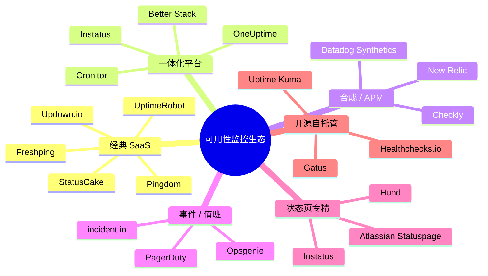

### 2.1 竞品速览表

| 产品 | 免费层锚点 | 付费入门 | 核心卖点 | 典型用户 |
|------|-----------|----------|----------|----------|
| **UptimeRobot** | 50 监控 / 5min | Solo $7–9/月 | 极简上手、监控数量 | Solo dev、side project |
| **Better Stack** | 10 监控 / 3min | ~$29/月 | 监控+日志+值班+事件+状态页 | 成长型 DevOps 团队 |
| **StatusCake** | 10 监控 / 5min | ~$16/月 | 页面速度、SSL、30+ 国家 | 预算敏感 SMB |
| **Pingdom** | 无 | $15+/月 | 品牌、100+ 探针、RUM | 中大型企业 |
| **Checkly** | 有限 | ~$14/月 | Playwright 合成、API 链 | API-first 团队 |
| **Instatus** | 有 | 扁平月费 | 状态页+监控+Slack 事件 | 需要客户沟通的产品团队 |
| **OneUptime** | 开源自托管 | SaaS 分层 | 全栈可观测+事件+值班 | 想替代多工具的团队 |
| **incident.io** | 无监控 | 按席位 | Slack 原生事件指挥、AI SRE | 已有监控、缺事件流 |
| **Uptime Kuma** | 自托管免费 | $0 | 数据主权、Docker 一键 | 隐私/成本敏感 |

---

## 3. 用户关注功能全景（按关注度排序）

数据来源：G2/Capterra 评价主题词、DEV Community 对比文、UptimeRobot 知识库竞品文、Better Stack / Instatus 落地页卖点、Reddit r/selfhosted 与 r/devops 讨论（2024–2026）。

### 3.1 关注度排行榜（Top 25）

| 排名 | 功能 | 用户为什么在意 | 代表竞品 | PulseWatch |
|:----:|------|----------------|----------|:----------:|
| 1 | **5 分钟内完成首个监控** | 决定是否留存 | 全部 | ✅ |
| 2 | **慷慨免费层 + 可商用** | UptimeRobot 2024 禁商用后的迁移潮 | UR、PulseWatch | ✅ 15 个 |
| 3 | **邮件 / Slack / Webhook 告警** | 基础通知闭环 | 全部 | ✅ |
| 4 | **检测间隔 ≤1 分钟** | 故障发现速度 | BS、UR Team | ⚠️ 付费档 |
| 5 | **SSL 证书到期提醒** | 运维高频痛点 | BS、StatusCake | ✅ |
| 6 | **公开状态页** | 客户信任、PLG 传播 | 全部 | ✅ |
| 7 | **多区域探针** | 减少误报、验证全球可达 | BS、Pingdom | ✅ N-of-M |
| 8 | **维护窗口** | 避免计划内误告警 | UR、BS | ✅ |
| 9 | **Heartbeat / Cron 监控** | 后台任务静默失败 | BS、Healthchecks | ✅ |
| 10 | **自定义域状态页** | 品牌专业度 | BS、Statuspage | ✅ |
| 11 | **状态页邮件订阅** | 客户主动获知故障 | BS、Instatus | ✅ |
| 12 | **SMS / 电话告警** | 夜间/on-call 必达 | UR Pro、BS | ⚠️ SMS only |
| 13 | **故障截图 / 响应体取证** | 快速定位根因 | BS | ⚠️ body snippet |
| 14 | **On-Call 排班与升级** | 团队规模化 | BS、PagerDuty | ⚠️ 轮值 MVP |
| 15 | **事件时间线 + 指派** | MTTR 降低 | BS、incident.io | ⚠️ 时间线/备注 |
| 16 | **告警智能合并** | 多监控同时宕机防轰炸 | BS | ⚠️ 15min 去重 |
| 17 | **PagerDuty / Teams 集成** | 企业工具链 | UR、BS | ⚠️ PD only |
| 18 | **API + Terraform** | 基础设施即代码 | BS、Checkly | ⚠️ OpenAPI 骨架 |
| 19 | **关键词 / JSON 断言** | API 契约验证 | UR、Checkly | ✅ |
| 20 | **DNS 监控** | 配置漂移检测 | BS、Site24x7 | ✅ |
| 21 | **页面速度 / Core Web Vitals** | SEO 与体验 | StatusCake、Pingdom | ❌ |
| 22 | **多步合成事务** | 登录→下单等用户流 | Checkly、Pingdom | ⚠️ 请求链 5 步 |
| 23 | **域名到期监控** | 与 SSL 并列高频 | BS、StatusCake | ✅ RDAP |
| 24 | **SLA 报告导出** | 对外合规、客户汇报 | Uptime.com | ✅ CSV/HTML |
| 25 | **AI 根因摘要 / 关联日志** | 2025+ 新兴期望 | BS、incident.io | ❌ |

**图例**：✅ 已实现 | ⚠️ 部分实现 | ❌ 未实现

### 3.2 用户决策旅程中的「功能权重」

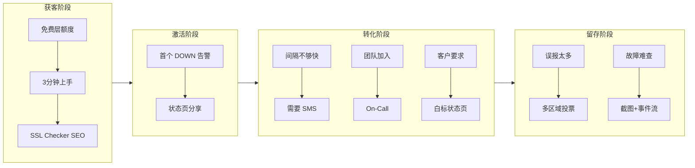

---

## 4. 竞品功能对比矩阵（详细）

### 4.1 监控能力

| 功能 | UptimeRobot | Better Stack | StatusCake | Pingdom | Checkly | **PulseWatch** |
|------|:-----------:|:------------:|:----------:|:-------:|:-------:|:--------------:|
| HTTP/HTTPS | ✅ | ✅ | ✅ | ✅ | ✅ | ✅ |
| TCP / Ping / Port | ✅ | ✅ | ✅ | ✅ | ✅ | ✅ |
| 关键词匹配 | ✅ | ✅ | ✅ | ✅ | ✅ | ✅ |
| SSL 到期 | ✅ | ✅ 原生 | ✅ | ✅ | ✅ | ✅ |
| 域名到期 | ❌ | ✅ | ✅ | ✅ | ❌ | ❌ |
| DNS 记录 | ❌ | ✅ | ✅ | ✅ | ❌ | ✅ |
| Heartbeat/Cron | ✅ | ✅ | ❌ | ❌ | ✅ | ✅ |
| JSON/API 断言 | ❌ | ✅ | ❌ | ✅ | ✅ | ✅ |
| 多步请求链 | ❌ | ⚠️ | ❌ | ✅ 合成 | ✅ Playwright | ⚠️ 5 步 HTTP |
| 浏览器合成 | ❌ | ❌ | ❌ | ✅ | ✅ | ❌ |
| 页面速度 | ❌ | ❌ | ✅ | ✅ RUM | ❌ | ❌ |
| 最短间隔 | 30s 付费 | 30s | 60s | 60s | 可配置 | 30s 路线图 |
| 探针区域数 | 12 | 12+ | 30+ | 100+ | 20+ | 2→20 路线图 |
| 失败截图 | ❌ | ✅ | ❌ | ❌ | ✅ | ❌ |
| Traceroute/MTR | ❌ | ✅ | ❌ | ❌ | ❌ | ❌ |

### 4.2 告警与事件

| 功能 | UptimeRobot | Better Stack | incident.io | **PulseWatch** |
|------|:-----------:|:------------:|:-----------:|:--------------:|
| Email | ✅ | ✅ | ✅ | ✅ |
| Slack / Discord | ✅ | ✅ | ✅ | ✅ |
| Webhook | ✅ | ✅ | ✅ | ✅ |
| SMS / 语音 | 付费 | ✅ 包量 | 集成 | ❌ |
| PagerDuty | ✅ | ✅ | ✅ | ✅ |
| MS Teams | ❌ | ✅ | ✅ | ❌ |
| 告警延迟 / 去重 | ⚠️ | ✅ 智能合并 | ✅ | ⚠️ 15min+flapping |
| On-Call 排班 | ❌ | ✅ | ✅ | ❌ |
| 升级策略 | ❌ | ✅ | ✅ | ❌ |
| 事件指派 / 备注 | ❌ | ✅ | ✅ | ❌ |
| Post-mortem 模板 | ❌ | ✅ | ✅ | ❌ |
| AI 调查摘要 | ❌ | ⚠️ | ✅ | ❌ |

### 4.3 状态页与增长

| 功能 | UptimeRobot | Better Stack | Statuspage | **PulseWatch** |
|------|:-----------:|:------------:|:----------:|:--------------:|
| 免费状态页 | ✅ 品牌 | ✅ | ❌ | ✅ 品牌 |
| 自定义域 | 付费 | ✅ | ✅ | ✅ |
| 邮件订阅 | ❌ | ✅ | ✅ | ✅ |
| 事件公告手动发布 | ❌ | ✅ | ✅ | ❌ |
| 维护计划展示 | ⚠️ | ✅ | ✅ | ⚠️ 窗口有，页未联动 |
| 白标 / 去水印 | 付费 | 付费 | ✅ | ❌ |
| 嵌入组件 SDK | ❌ | ✅ React | ✅ | ❌ |
| 90 天 uptime 历史 | ⚠️ | ✅ | ✅ | ⚠️ |

### 4.4 开发者与企业

| 功能 | UptimeRobot | Better Stack | **PulseWatch** |
|------|:-----------:|:------------:|:--------------:|
| REST API | ✅ | ✅ | ✅ |
| API Keys | ✅ | ✅ | ✅ |
| OpenAPI | ❌ | ✅ | ⚠️ 骨架 |
| Terraform Provider | ❌ | ✅ | ⚠️ README 示例 |
| 2FA | ❌ | ✅ | ✅ |
| 审计日志 | ❌ | ⚠️ | ✅ |
| SSO | ❌ | Team+ | ❌ |
| 多组织切换 | ❌ | ✅ | ✅ |

---

## 5. 用户呼声深度解读（按场景）

### 5.1 Solo Developer（最大用户群）

> 「我只想加 URL、收邮件，免费层别限制商用。」— UptimeRobot 评价高频

| 关注功能 | 优先级 | PulseWatch 策略 |
|----------|:------:|-----------------|
| 快速创建监控 | P0 | 保持模板 + Wizard |
| 15+ 免费监控 | P0 | 强调 **商用友好**（vs UR 禁商用） |
| 邮件 + Discord | P0 | 已有 |
| SSL 到期 | P0 | 已有 + SSL Checker SEO 获客 |
| 状态页带品牌 | P1 | PLG「Powered by」换传播 |

### 5.2 成长型 SaaS 团队（付费转化核心）

> 「UR 免费够用，但团队起来就得换 Better Stack。」— DEV Community 2026

| 关注功能 | 优先级 | 设计 implication |
|----------|:------:|------------------|
| 30s–60s 检测 | P0 | Pro 1min → Team 60s → Business 30s |
| SMS / 电话 | P0 | **Phase 4A** Twilio 集成 |
| On-Call 轮值 | P1 | **Phase 4B** 轻量排班 |
| 故障截图 | P1 | Headless Chrome 探针侧 |
| 事件时间线 | P1 | 扩展现有 Incident 模型 |
| PagerDuty + Teams | P1 | Teams webhook 模板 |

### 5.3 Agency / 多客户管理

| 关注功能 | 优先级 |
|----------|:------:|
| 多组织 / 客户分组 | P1 |
| 白标状态页 | P1 |
| 批量 API 创建监控 | P1 |
| SLA PDF 白标 | P2 |

### 5.4 企业采购（Business 套餐）

| 关注功能 | 优先级 |
|----------|:------:|
| SSO (SAML/OIDC) | P2 |
| 审计 + 合规导出 | P1 部分已有 |
| 100+ 探针区域 | P2 |
| RUM / 合成 | P3 不做全 APM |

---

## 6. PulseWatch 差距与 Phase 4 路线图

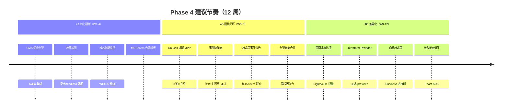

### 6.1 优先级矩阵

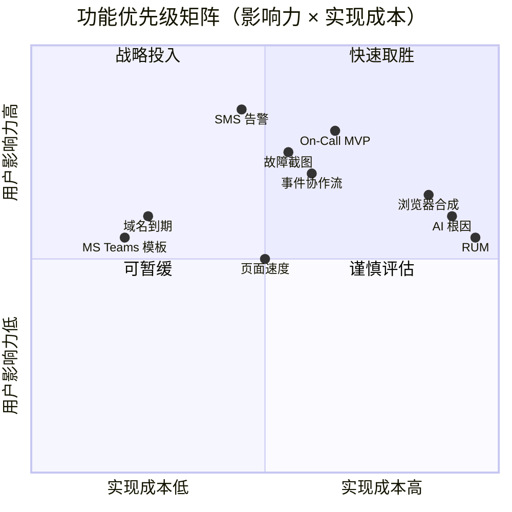

---

## 7. Phase 4 功能详细设计

### 7.1 P4-1：SMS / 语音告警

#### 7.1.1 用户故事

> 作为 on-call 工程师，当生产 API 在凌晨故障时，我希望收到电话或短信，因为邮件和 Slack 我可能看不到。

#### 7.1.2 功能规格

| 项 | 规格 |
|----|------|
| 套餐 | Business 含 500 SMS/月；超额 $0.05/条；语音 $0.10/次 |
| 渠道配置 | 设置 → 集成 → 添加「SMS」渠道，验证手机号（OTP） |
| 触发 | 与现有告警管道一致：DOWN 立即；UP 恢复可选 |
| 限速 | 同一监控 15min 内最多 3 条 SMS（复用降噪） |
| 国际化 | 默认 +86/+1；Twilio Verify + Messaging |

#### 7.1.3 架构图

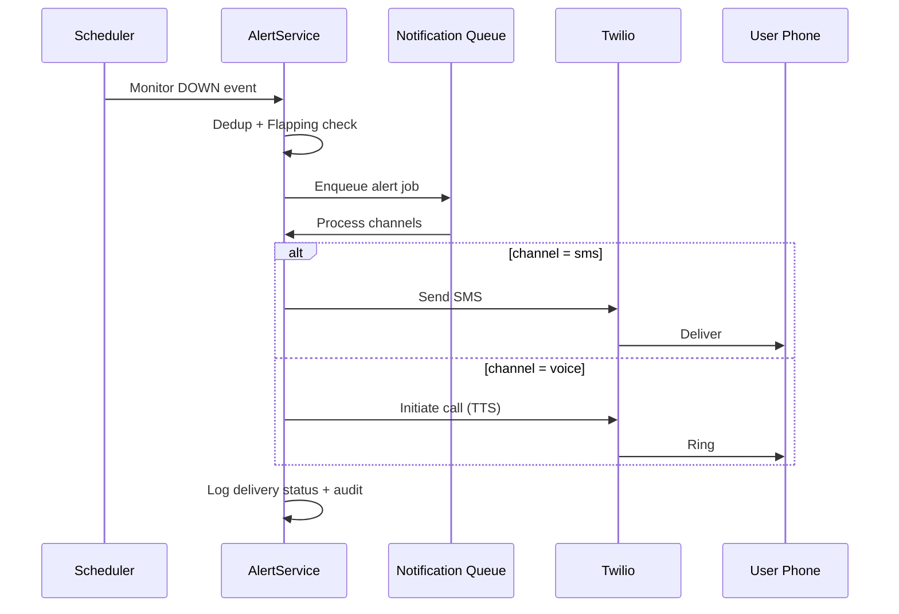

#### 7.1.4 数据模型

```sql
-- alert_channels.type 新增 'sms', 'voice'
-- channel config: { "phone": "+86138...", "verified": true }

CREATE TABLE sms_usage (
    id          UUID PRIMARY KEY,
    org_id      UUID NOT NULL REFERENCES organizations(id),
    month       DATE NOT NULL,
    sms_count   INT DEFAULT 0,
    voice_count INT DEFAULT 0,
    UNIQUE (org_id, month)
);
```

#### 7.1.5 UI 线框

```
┌─ 设置 › 集成 › 添加渠道 ─────────────────────────────────┐
│  渠道类型  [ SMS ▼ ] [ 语音 ▼ ]                            │
│  手机号    [ +86 138 **** 1234 ]  [ 发送验证码 ]           │
│  验证码    [ ______ ]                                      │
│  告警规则  ☑ 故障时发送  ☐ 恢复时发送                       │
│  本月用量  12 / 500 条                                     │
│                                    [ 取消 ]  [ 保存并验证 ] │
└────────────────────────────────────────────────────────────┘
```

---

### 7.2 P4-2：故障截图与响应取证

#### 7.2.1 用户故事

> 作为开发者，当网站 DOWN 时，我想看到失败时的页面截图和 HTTP 响应体，而不是只知道「连接超时」。

#### 7.2.2 功能规格

| 项 | 规格 |
|----|------|
| 范围 | HTTP/HTTPS 监控；DOWN 时触发 |
| 截图 | 1280×720 PNG，探针侧 headless Chromium |
| 响应体 | 截断至 64KB；存对象存储（S3/MinIO） |
| 保留 | Free 7 天；Pro 30 天；Team+ 90 天 |
| 展示 | 监控详情 › 检测记录 › 展开行 › 「取证」Tab |

#### 7.2.3 架构图

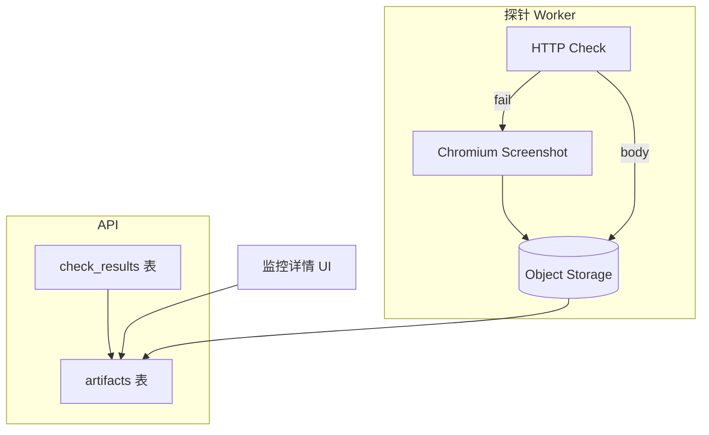

#### 7.2.4 UI 线框

```
┌─ 监控详情 › 检测记录 ──────────────────────────────────────┐
│  时间              区域      状态    响应    操作           │
│  05-29 03:15:02   us-east   DOWN   502ms   [ 详情 ▼ ]      │
│  ┌─ 展开 ───────────────────────────────────────────────┐  │
│  │  [ 截图 ]  [ 响应头 ]  [ 响应体 ]  [ 耗时分解 ]        │  │
│  │  ┌──────────────────┐  Status: 502                   │  │
│  │  │   (screenshot)   │  Body: {"error":"..."}         │  │
│  │  └──────────────────┘                                  │  │
│  └──────────────────────────────────────────────────────┘  │
└────────────────────────────────────────────────────────────┘
```

---

### 7.3 P4-3：On-Call 排班 MVP

#### 7.3.1 用户故事

> 作为团队 Lead，我希望设置每周轮值，故障时先通知主值班，15 分钟无确认则升级到备用值班。

#### 7.3.2 功能规格（MVP 克制范围）

| 包含 | 不包含（Phase 5） |
|------|-------------------|
| 每周轮值表（按成员顺序） | 复杂假期日历 |
| 1 级升级（主 → 备） | 多团队路由 |
| 与现有告警渠道绑定 | 独立 PagerDuty 替代 |
| Slack「认领」回调 | 手机 App |

#### 7.3.3 架构图

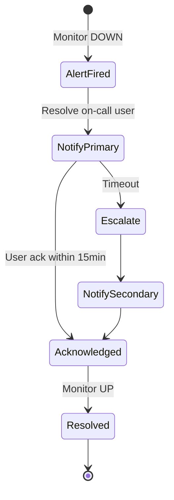

#### 7.3.4 数据模型

```sql
CREATE TABLE on_call_schedules (
    id          UUID PRIMARY KEY,
    org_id      UUID NOT NULL,
    name        VARCHAR(100) NOT NULL,
    timezone    VARCHAR(50) DEFAULT 'UTC',
    created_at  TIMESTAMPTZ DEFAULT now()
);

CREATE TABLE on_call_rotations (
    id           UUID PRIMARY KEY,
    schedule_id  UUID REFERENCES on_call_schedules(id),
    user_id      UUID REFERENCES users(id),
    position     INT NOT NULL,
    escalation_level INT DEFAULT 1
);

CREATE TABLE on_call_overrides (
    id           UUID PRIMARY KEY,
    schedule_id  UUID,
    user_id      UUID,
    starts_at    TIMESTAMPTZ,
    ends_at      TIMESTAMPTZ
);
```

#### 7.3.5 UI 线框

```
┌─ 设置 › On-Call ───────────────────────────────────────────┐
│  排班表: [ Production Primary ▼ ]     [ + 新建排班 ]        │
│                                                            │
│  本周轮值                                                   │
│  ┌────────┬────────┬────────┬────────┬────────┬────────┐   │
│  │  Mon   │  Tue   │  Wed   │  Thu   │  Fri   │  ...   │   │
│  │ Alice  │ Bob    │ Alice  │ Carol  │ Bob    │        │   │
│  │ (L1)   │ (L1)   │ (L1)   │ (L1)   │ (L1)   │        │   │
│  └────────┴────────┴────────┴────────┴────────┴────────┘   │
│  升级: 15 分钟无确认 → Carol (L2)                           │
│  通知渠道: ☑ SMS  ☑ Slack  ☐ Email                         │
└────────────────────────────────────────────────────────────┘
```

---

### 7.4 P4-4：事件协作流（Incident Workflow）

#### 7.4.1 用户故事

> 作为 on-call，当故障发生时，我需要一个事件页面记录时间线、指派处理人、并最终写 post-mortem。

#### 7.4.2 功能规格

| 状态 | 说明 |
|------|------|
| `investigating` | 自动创建，关联 Monitor |
| `identified` | 已定位原因 |
| `monitoring` | 修复中观察 |
| `resolved` | 恢复 |

| 能力 | 规格 |
|------|------|
| 自动创建 | 首个 DOWN 且持续 >2min |
| 智能合并 | 5min 内同 Org 多监控 DOWN → 单事件 |
| 时间线 | 状态变更、备注、告警通知自动记入 |
| 指派 | `@user` 或下拉选择成员 |
| 状态页联动 | 可选「同步到公开状态页」 |
| Post-mortem | Resolved 后引导填写模板（Markdown） |

#### 7.4.3 事件流架构

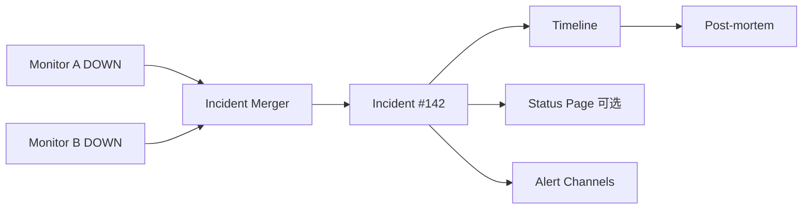

#### 7.4.4 UI 线框 — 事件指挥页

```
┌─ 事件 #142 — API 网关故障 ────────────────  investigating ▼ ┐
│  影响监控: api.example.com, auth.example.com    指派: @alice │
├──────────────────────────────────────────────────────────────┤
│  时间线                                                       │
│  ● 03:15  监控 api 检测失败 (us-east, eu-west)               │
│  ● 03:15  告警已发送 → Slack #oncall, SMS → Alice            │
│  ● 03:18  @alice 备注: 正在查看 DB 连接池                     │
│  ○ 03:22  状态 → identified                                  │
│  [ 添加备注... ]                              [ 更新状态 ]    │
├──────────────────────────────────────────────────────────────┤
│  ☐ 同步到状态页 status.example.com                           │
└──────────────────────────────────────────────────────────────┘
```

---

### 7.5 P4-5：域名到期监控

#### 7.5.1 规格

| 项 | 值 |
|----|-----|
| 类型 | 新 monitor type: `domain` |
| 输入 | `example.com`（自动 WHOIS） |
| 告警阈值 | 30 / 14 / 7 天前（可配置） |
| 频率 | 每日 1 次 |
| 不消耗 | 不计入高频检测配额 |

---

### 7.6 P4-6：页面速度监控（轻量）

#### 7.6.1 规格

| 项 | 值 |
|----|-----|
| 指标 | TTFB、DOM Load、LCP（简化） |
| 频率 | 最低 5 分钟 |
| 套餐 | Team+ |
| 实现 | 探针 headless 采集，非完整 RUM |

---

## 8. 信息架构与导航演进

### 8.1 当前 IA

```
Dashboard
├── Monitors
├── Incidents
├── Status Pages
└── Settings
    ├── Profile / Security / Notifications
    ├── Integrations / Team / Maintenance
    ├── API Keys / Audit / Billing
```

### 8.2 Phase 4 目标 IA

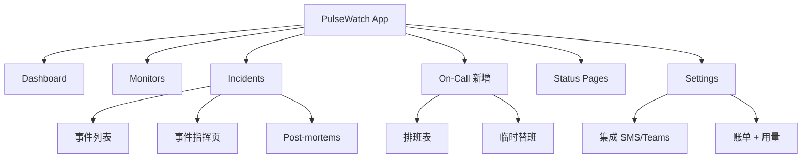

---

## 9. 设计图：端到端可靠性闭环

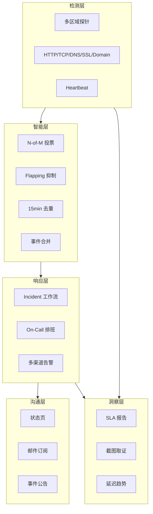

---

## 10. 设计图：竞品 → PulseWatch 迁移卖点

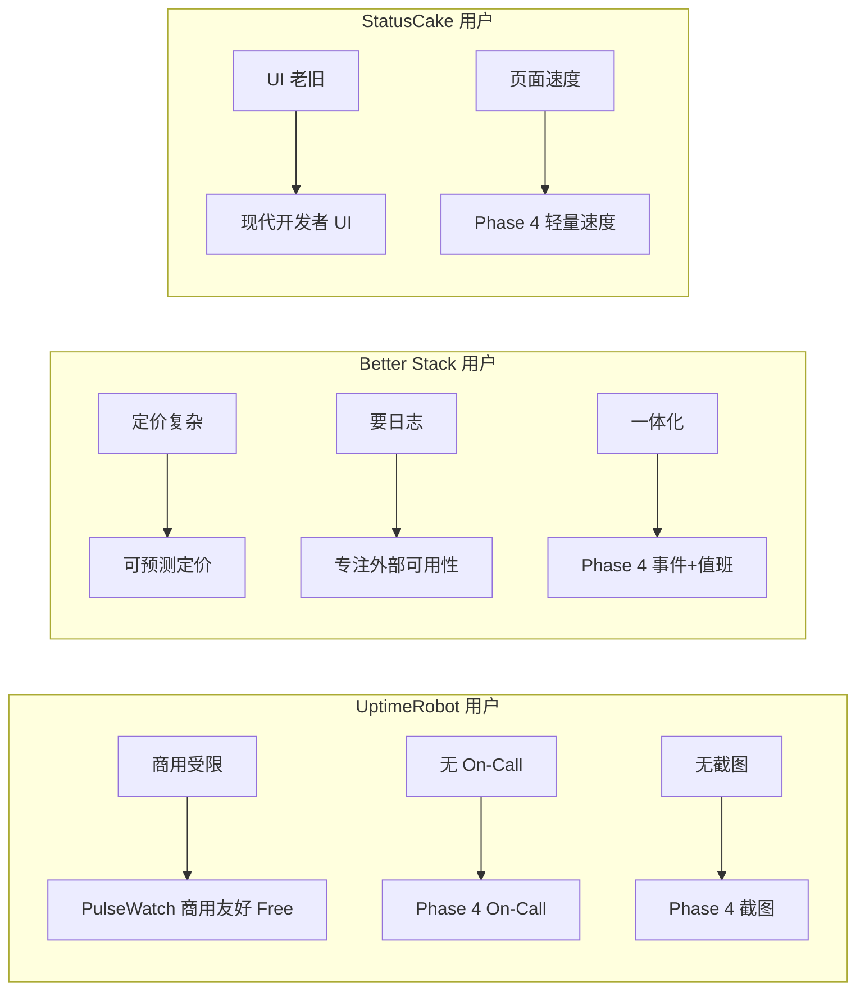

---

## 11. 定价与功能门控建议（Phase 4 更新）

| 功能 | Free | Pro | Team | Business |
|------|:----:|:---:|:----:|:--------:|
| SMS 告警 | ❌ | ❌ | ❌ | 500/月 |
| 故障截图 | ❌ | 30 天 | 90 天 | 1 年 |
| On-Call 排班 | ❌ | ❌ | 3 人轮值 | 无限 |
| 事件协作 | 只读 | 基础 | 完整 | + 导出 |
| 域名到期 | 1 个 | 5 个 | 20 个 | 无限 |
| 页面速度 | ❌ | ❌ | ✅ | ✅ |
| 白标状态页 | ❌ | ❌ | ❌ | ✅ |

---

## 12. 成功指标（Phase 4）

| 指标 | 基线 | 目标 |
|------|------|------|
| 免费 → Pro 转化 | ~5% | 8%（SMS/截图 push） |
| UR 迁移用户占比 | — | 注册来源 25% 来自对比页 |
| 团队套餐占比 | — | 付费用户 20% Team+ |
| MTTR（有事件流用户） | — | 较无事件流 -30% |
| 状态页 PLG 注册 | — | 状态页来源注册 10% |

---

## 13. 附录：竞品定价锚点（2026）

| 产品 | 免费 | 入门付费 | 备注 |
|------|------|----------|------|
| UptimeRobot | 50 @ 5min | $7/mo | 商用限制 |
| Better Stack | 10 @ 3min | $29/mo | 含值班 |
| StatusCake | 10 @ 5min | ~$16/mo | 速度检测 |
| Pingdom | — | $15/mo | 10 checks |
| **PulseWatch Founding** | 15 @ 5min | **$1/mo** Pro | 商用友好 |

---

## 14. 下一步行动（Phase 5）

1. **产品**：按 [PRODUCT-ROADMAP.md](PRODUCT-ROADMAP.md) 确认 P5 优先级  
2. **工程**：按 [IMPLEMENTATION-ROADMAP.md](IMPLEMENTATION-ROADMAP.md) 逐项自动化交付（测试 → 部署 → 验证）  
3. **设计**：补齐移动端底栏、Monitor 取证 Tab、On-Call 日历视图（对齐 [UI-UX-DESIGN.md](UI-UX-DESIGN.md)）  
4. **增长**：`/pricing` 功能对比表 + 「UptimeRobot 商用替代」落地页  
5. **国内**：部署钉钉/飞书/企微渠道（migration `008`）

---

## 15. PulseWatch 差距矩阵（Phase 5 基准）

**图例**：✅ 已交付 | ⚠️ 部分/MVP | ❌ 未实现 | 🔜 代码已有待部署

| Area | 竞品 baseline | PulseWatch today | Gap | Priority | UI/page notes |
|------|---------------|------------------|-----|:--------:|---------------|
| **Monitor types** | HTTP/TCP/Ping/SSL/Keyword/DNS/Heartbeat/API/Domain/合成 | HTTP/TCP/Ping/Keyword/SSL/DNS/Heartbeat/Domain/Pagespeed + 5 步 HTTP 链 | 无 Playwright 浏览器合成；Pagespeed 仅 TTFB 阈值 | P2 | `/monitors/new` 模板已覆盖；合成需新 Wizard 步骤 |
| **Multi-region** | UR 12 / BS 12+ / Pingdom 100+ **独立探针** | N-of-M 投票 ✅；**同 API 进程模拟多 region 标签** | 真分布式 Worker + 区域延迟分解 | **P0** | 创建监控「区域」选择器需地图/延迟预览 |
| **Alerting channels** | Email/Webhook/Slack/Discord/PD/Teams/SMS/Voice | 上述 + SMS(Twilio) + 🔜钉钉/飞书/企微 | 语音电话；Opsgenie；告警投递状态 Dashboard | P1 | `settings` › Integrations 已拥挤 → 分组 Tab |
| **On-call** | BS 排班+升级+Ack+覆盖班 | 日轮值 MVP + escalationMinutes 字段 | Ack 超时升级、临时替班 UI、Slack `/ack` | P1 | 从 Settings 子 Tab 升为 **顶级 `/on-call`** |
| **Incidents** | 合并+指派+状态机+Post-mortem | 5min 合并、时间线、备注、workflow、postMortem 字段 | 指派 UI、关联根因标签、Post-mortem 模板导出 | P1 | `/incidents/[id]` 需指挥台布局（见 §7.4 线框） |
| **Status page** | 自定义域+订阅+维护+事件+白标+嵌入 | 自定义域+订阅+Incident 同步+组件分组 | 手动公告编辑器、90 天 uptime 条、白标、React 嵌入 | P1 | `/status-pages` 编辑页缺「发布公告」；公开页缺历史条 |
| **Maintenance** | Cron/一次性+状态页联动 | API + Settings Tab ✅ | 状态页自动展示「Scheduled Maintenance」横幅 | P2 | 维护创建时增加「同步状态页」勾选 |
| **Reports/SLA** | CSV/PDF/白标/月报邮件 | CSV + HTML ✅ | PDF 导出、自动月报邮件、SLA 违约告警 | P2 | Dashboard 或 `/reports` 新页 |
| **Teams/RBAC** | Owner/Admin/Member/Viewer+审计 | RBAC+邀请+Org Switcher+审计 ✅ | 组织级 2FA 强制、细粒度监控标签权限 | P2 | Team Tab 部分文案未 i18n |
| **Billing** | Stripe 全套餐+用量计 | Founding Stripe Checkout + 徽章 | Team/Business 档位、SMS 用量计、配额硬限制 UI | P1 | `/settings` Billing Tab 需套餐对比 |
| **API** | REST+OpenAPI+Terraform+Actions | REST+OpenAPI+API Keys+Terraform README | 正式 Provider、GitHub Action、Webhook 签名文档 | P1 | 开发者文档站 `/docs` |
| **Mobile** | 响应式或原生 App | 响应式表格；**无移动端底栏** | 375px 底 Tab、Touch ≥44px、PWA 离线缓存 | **P0** | `dashboard-shell.tsx` 仅 `md:` 侧栏 |
| **i18n** | 英文为主；国内云全中文 | en + zh ✅ | Settings 部分硬编码中文 Tab；状态页订阅文案 | P2 | 统一 `messages/*.json` |
| **Onboarding** | 3 步 Wizard + 模板 | Wizard + 模板 ✅ | 第四步「连接 Slack/钉钉」；完成率埋点 | P2 | `onboarding-wizard.tsx` 扩展 |
| **Integrations（国内）** | 阿里云/腾讯/华为：钉钉/飞书/短信原生 | 🔜 钉钉/飞书/企微 Webhook（`alerts_cn.go`） | 部署 migration 008；加签 UI 已有 | **P0**（国内） | `alert-integrations.tsx` 已支持 |
| **Anomaly detection** | 阈值+基线+用户可见告警 | 7 日基线日志 `[ANOMALY]` | 用户可见 Insight 卡片 + 可选告警渠道 | P2 | Dashboard 新增「Insights」区 |
| **Self-host 对标** | Uptime Kuma：Docker、多通知、美观 UI | SaaS only | 暂不做自托管；强调商用 Free + 托管 SLA | P3 | 着陆页 FAQ 说明 |

### 15.1 国内云可观测平台对比（公开能力摘要）

| 能力 | 阿里云云监控 | 腾讯云可观测 | 华为云 AOM | PulseWatch |
|------|-------------|-------------|-----------|------------|
| 基础设施/云资源监控 | ✅ ECS/RDS/LB 自动发现 | ✅ | ✅ | ❌ 专注**外部**可用性 |
| APM/链路追踪 | ✅ ARMS | ✅ APM | ✅ | ❌ 非目标 |
| 日志分析 | ✅ SLS | ✅ CLS | ✅ LTS | ❌ |
| 外部 HTTP 探测 | ✅ 站点监控 | ✅ 云拨测 | ✅ 拨测 | ✅ 核心 |
| 钉钉/飞书/企微 | ✅ 原生 | ✅ | ✅ | 🔜 Webhook 机器人 |
| 短信/电话告警 | ✅ 国内运营商 | ✅ | ✅ | ⚠️ Twilio SMS |
| 状态页 | ⚠️ 有限/第三方 | ⚠️ | ⚠️ | ✅ 产品核心 |
| 定价 | 按量+包年 | 按量 | 按量 | 可预测 SaaS 订阅 |

**国内机会**：PulseWatch 不做全栈 APM，以 **外部拨测 + 状态页 + 商用友好定价 + IM 告警** 对标 UptimeRobot/Better Stack，而非替换阿里云/腾讯全家桶。

---

## 16. UX / 页面优化建议

| 页面/组件 | 现状 | 建议 | 关联 Phase |
|-----------|------|------|------------|
| `dashboard-shell.tsx` | 侧栏 `hidden md:block`，移动无主导航 | 增加底部 Tab：Dashboard / Monitors / Incidents / More | P5-2 |
| `/monitors` | 表格列表，无虚拟滚动/批量 | 100+ 监控虚拟滚动；批量暂停/删除/标签 | P5-8 |
| `/monitors/[id]` | 图表+检测记录 | 失败行展开「取证」Tab（截图+body+耗时分解） | P5-5 |
| `/incidents` | 列表+基础详情 | 指挥台：状态下拉、指派、影响监控 Chips | P5-4 |
| `/incidents/[id]` | 时间线+备注 | 右栏 Post-mortem 编辑器；「同步状态页」Toggle | P5-4 |
| Settings › On-Call | 嵌在 Settings 10 Tab 中 | 独立 `/on-call`：周日历+替班+升级规则 | P5-4 |
| Settings › Integrations | 10+ 渠道平铺 | 分组：Chat / IM-CN / On-call / Custom | P5-3 |
| `/status-pages` | CRUD + 组件 | 发布公告 WYSIWYG；预览维护横幅 | P5-6 |
| `/status/[slug]` | 组件状态+Incident 列表 | 90 天 uptime 条；RSS/Atom 订阅 | P5-6 |
| `/pricing` | Founding 定价 | 竞品功能对比表（锚定 UR/BS） | P5-15 |
| Landing `/` | Hero+定价 | UR 商用替代专题页 `/compare/uptimerobot` | P5-15 |
| 全局 | 无 ⌘K | Phase 5 末：命令面板跳转监控/事件 | P5-12 |

---

## 17. Phase 4 → Phase 5 状态对照

| Phase 4 ID | 文档原设计 | 实际交付（2026-05-30） | Phase 5 跟进 |
|------------|-----------|------------------------|--------------|
| P4-1 SMS | Twilio SMS+Voice | SMS only | P5-7 Voice |
| P4-2 截图 | Headless Chromium | `responseBodySnippet` in metadata | P5-5 截图+S3 |
| P4-3 On-Call | 轮值+升级 | 日轮值 MVP，无 Ack 超时 | P5-4 |
| P4-4 事件流 | 指派+Post-mortem | 时间线+workflow+postMortem 字段 | P5-4 UI |
| P4-5 域名 | WHOIS | RDAP ✅ | — |
| P4-6 页面速度 | LCP/DOM | TTFB 阈值 monitor type | P5-11 CWV |
| 国内 IM | — | 钉钉/飞书/企微 🔜 | P5-3 部署 |

---

*本文档将随竞品变化每季度复审一次。实施 backlog 见 [IMPLEMENTATION-ROADMAP.md](IMPLEMENTATION-ROADMAP.md)。*
