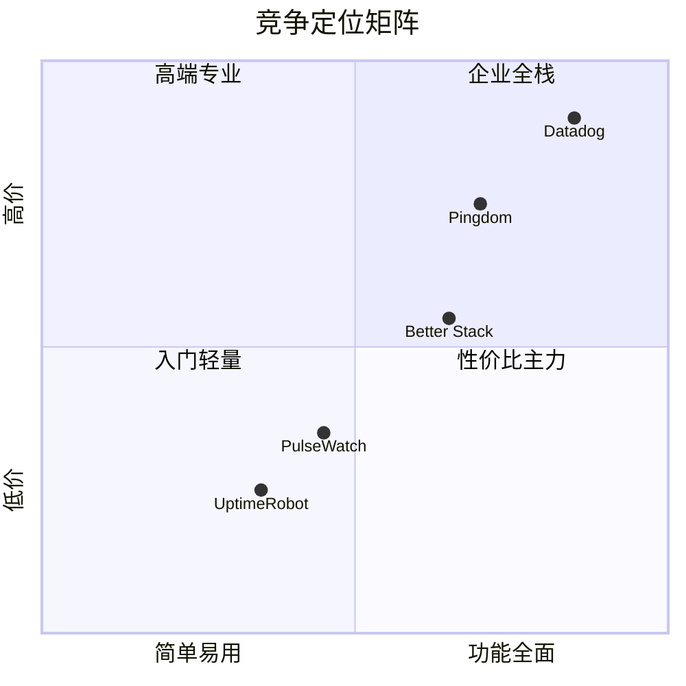

# PulseWatch — 产品需求文档（PRD）

**文档版本**：v1.1  
**产品语言**：英文（面向全球市场）  
**目标读者**：产品、工程、增长团队  
**竞品基准**：UptimeRobot、Better Stack、Pingdom、StatusCake、Datadog Synthetics、Site24x7、New Relic

---

## 竞品研究摘要

| 平台 | 免费层 | 付费入门 | 核心差异化 | 弱点/机会 |
|------|--------|----------|------------|-----------|
| **UptimeRobot** | 50 监控 / 5 分钟；**禁止商用**（2024.12） | Solo $9/月，60 秒 | 品牌认知、监控数量 | 免费层商用风险；Solo 仅 10 监控 |
| **Better Stack** | 10 监控 / 3 分钟 | Responder $29/月 + 按量加监控 | 事件管理 + 日志 + 值班一体化 | 定价复杂、非纯监控用户成本高 |
| **StatusCake** | 10 监控 / 5 分钟 | ~$16/月 Superior | 页面速度、SSL、30+ 国家 | UI 偏旧、功能分散 |
| **Pingdom** | 无免费层 | $15/月起 | 企业信任、RUM、合成事务 | 贵、对 indie 过重 |
| **Site24x7** | 5 基础监控 | $9/月 Web Uptime | 全栈 APM、130+ 探针 | 产品臃肿、学习曲线陡 |
| **Datadog Synthetics** | 无典型免费 | API $5/万运行 | 与可观测性深度集成 | 按运行计费，小团队难预测成本 |

**成功共性**：5 分钟内可完成首个监控、免费层足够「尝到价值」、状态页作病毒传播、Slack/Webhook 集成、SSL 到期提醒、清晰升级路径（间隔 / 区域 / 告警渠道 / 历史数据）。

**我们的机会**：UptimeRobot 禁止商用后，**允许个人与小团队商用的慷慨免费层** + **开箱即用的异常检测与趋势洞察** + **SEO 工具矩阵获客** + **现代开发者体验**（API-first、Terraform 后期）。

---

## A. 产品愿景与定位

### A.1 产品愿景

> 让每位开发者和小团队在 3 分钟内获得企业级可用性洞察，无需复杂配置或隐藏账单。

### A.2 目标用户

| 细分 | 画像 | 核心痛点 | 产品诉求 |
|------|------|----------|----------|
| **Solo Dev / Indie Hacker** | 1–5 个 side project | 需要商用友好免费层、SSL 提醒 | 快速上手、邮件/Discord 告警 |
| **SMB / 初创** | 5–50 个 URL/API | 多区域、1 分钟检测、状态页 | Pro/Team，品牌状态页 |
| **Agency** | 管理 20+ 客户站点 | 多租户、白标、批量 API | Business + 客户分组 |
| **DevOps 进阶** | 已有 Datadog/New Relic | 需要轻量外部合成探针 | Webhook、PagerDuty、SLA 报告 |

### A.3 竞争定位

**vs UptimeRobot**：同等免费监控数量感知（15 vs 50，但**允许商用**）；更强趋势/异常；现代 UI。  
**vs Better Stack**：不做全栈可观测性，专注「外部可用性 + 状态页 + 智能告警」，定价可预测。  
**vs Pingdom**：价格约为 1/3，面向 SMB 而非企业采购流程。  
**早期获客**：Founding Member 计划下 Pro **$1/月**（标准 $12），终身锁价，直接压制 UptimeRobot Solo $9/月。

### A.4 独特价值主张（UVP）

1. **Commercial-friendly Free**：个人项目与早期 SaaS 可合法使用免费层（公平使用政策，非滥用）。
2. **Insights, not just pings**：默认展示 p95 延迟趋势、异常尖峰、SSL/域名到期时间线。
3. **Discoverable by design**：免费 SSL 检测器、Uptime 计算器、对比页 → 自然注册转化。
4. **Status pages that sell**：公开状态页底部「Powered by PulseWatch」+ 一键克隆模板（PLG）。
5. **Founding Member 终身锁价**：早期用户 **$1/mo Pro** 永久保留，Founding 徽章驱动 PLG 传播。

**品牌 Slogan（英文）**：*Monitor smarter. Alert faster. Stay discoverable.*

---

## B. 定价与早期获客

> 完整定价策略见 [定价与增长策略](PRICING-AND-GROWTH.md)。

### B.1 标准定价层级

| 套餐 | 标准月价 | 监控数 | 核心差异 |
|------|----------|--------|----------|
| Free | $0 | 15 | 商用友好、Email/Webhook 告警 |
| Pro | $12 | 50 | 1 分钟间隔、Slack/Discord |
| Team | $39 | 150 | 5 seats、PagerDuty、SLA 报告 |
| Business | $99 | 500 | SMS、SSO、全区域探针 |

### B.2 Founding Member 早期 1 折计划

| 套餐 | 标准月价 | Founding 月价 | 说明 |
|------|----------|---------------|------|
| Pro | $12 | **$1** | 前 5,000 名或上线 12 个月内 |
| Team | $39 | **$4** | 终身锁价（Grandfather Clause） |
| Business | $99 | **$10** | Founding Member 徽章 |

**产品需求（P0）**：

| ID | 需求 | 验收标准 |
|----|------|----------|
| PRICE-01 | 着陆页 Founding Member CTA + 剩余名额 | Hero 首屏可见；名额实时更新 |
| PRICE-02 | 定价页原价划线 + 1 折价对比 | `/pricing` 含 FAQ schema |
| PRICE-03 | Stripe Founding Price ID + metadata | `founding_member=true` 写入 org |
| PRICE-04 | 账户 Founding Member 徽章 | 设置页与状态页可选展示 |
| PRICE-05 | 升级弹窗 Founding 文案 | 配额触顶时展示 $1/mo CTA |

---

## C. 功能需求（详细）

### C.1 用户认证与 Onboarding

| ID | 需求 | 优先级 | 验收标准 |
|----|------|--------|----------|
| AUTH-01 | Email + 密码注册，邮箱验证 | P0 | 验证链接 24h 有效 |
| AUTH-02 | OAuth：Google、GitHub | P0 | 一键注册，合并同邮箱账户 |
| AUTH-03 | Magic Link 登录（可选 P1） | P1 | 15 分钟有效 |
| AUTH-04 | 2FA TOTP | P1（Team+） | Pro 可选，Team 强制可配置 |
| ONB-01 | 3 步引导：添加 URL → 选区域 → 测试告警 | P0 | 完成率 >60% |
| ONB-02 | 预置监控模板（WordPress, Stripe webhook, API health） | P1 | 一键导入 |

### C.2 监控类型

| 类型 | 说明 | Free | Pro+ |
|------|------|------|------|
| HTTP/HTTPS | 状态码、重定向链、TTFB、总耗时 | ✅ | ✅ |
| TCP | 端口连通 | ✅ | ✅ |
| Ping (ICMP) | 延迟、丢包 | ✅ | ✅ |
| DNS | A/AAAA/CNAME/MX 记录变化 | ❌ | ✅ |
| SSL 证书 | 到期天数、链完整性、TLS 版本 | ✅（仅到期告警） | 完整报告 |
| Keyword | 页面包含/不包含文本 | ✅ | ✅ |
| API/JSON | JSONPath 断言、Header 检查 | ❌ | ✅ |
| Heartbeat/Cron | 反向监控（cron 回调 URL） | ❌ | Team+ |

**HTTP 高级选项**：自定义 Header/Cookie、Basic Auth、POST body、跟随重定向上限、期望状态码范围、响应体大小上限。

### C.3 检测调度与多区域探针

- **调度器**：每个监控按 `interval_seconds` 在全局队列中生成 tick；支持抖动 ±5% 防雷鸣群效应。
- **区域**：Free 2 区；Pro 5 区；探针独立投票，**多数区域失败才记 DOWN**（可配置 N-of-M）。
- **重试**：失败后再检 2 次（间隔 30s），三次失败创建 Incident。
- **维护窗口**：按 cron/一次性暂停告警，状态页显示 "Scheduled Maintenance"。

### C.4 仪表盘

| 组件 | 功能 |
|------|------|
| Overview | 全部监控 UP/DOWN 数、24h/7d/30d uptime % |
| 监控详情 | 响应时间折线（p50/p95/p99）、状态码分布、事件时间线 |
| Incident Timeline | 开始/确认/恢复时间、持续时长、根因备注（手动） |
| 对比视图 | 多监控并排（Team+） |
| 导出 | CSV/PDF SLA 报告（Pro+） |

### C.5 统计与趋势

- **聚合粒度**：原始点（7 天）→ 5 分钟 roll-up（90 天）→ 1 小时 roll-up（13 月+）。
- **指标**：uptime %、平均/最小/最大延迟、p50/p95/p99、错误率、DNS 解析耗时。
- **SLA 报告**：按月生成，目标 SLA 可配置（如 99.9%），违约自动标红。
- **对比**：周同比、月同比（Team+）。

### C.6 异常检测

| 类型 | 算法思路 | 告警 |
|------|----------|------|
| 响应时间尖峰 | 7 天滚动基线 + 3σ 或 MAD | "Response time anomaly on api.example.com" |
| 可用性模式 | 同比同时段 downtime 频率 | 周报洞察 |
| SSL 到期 | 固定阈值 30/14/7/1 天 | 分级告警 |
| 域名到期 | WHOIS 查询（Pro+） | 同上 |
| 慢响应渐变 | 7 日 p95 上升 >40% | 建议升级套餐/扩容提示（非紧急） |
| 关联异常 | 同 ASN/同托管商多监控同时劣化 | Team+ "Possible provider incident" |

**MVP 异常**：阈值 + 简单移动平均；Phase 2 引入 per-monitor Holt-Winters 或 Isolation Forest（离线批处理）。

### C.7 告警

| 渠道 | Free | Pro | Team | Business |
|------|------|-----|------|----------|
| Email | ✅ | ✅ | ✅ | ✅ |
| Webhook | ✅ | ✅ | ✅ | ✅ |
| Slack | ❌ | ✅ | ✅ | ✅ |
| Discord | ❌ | ✅ | ✅ | ✅ |
| PagerDuty/Opsgenie | ❌ | ❌ | ✅ | ✅ |
| SMS | ❌ | ❌ | ❌ | ✅ |
| 告警策略 | 全部 DOWN | 按监控/标签 | 升级策略（15min→SMS） | 全局 on-call |

**告警降噪**：同一 Incident 15 分钟内不重复；恢复通知；Flapping 检测（5 分钟内状态切换 >4 次则抑制）。

### C.8 状态页（Status Page）

- 公开 URL：`status.pulsewatch.io/{slug}` 或 CNAME 自定义域。
- 组件：手动分组监控；订阅邮件更新。
- 设计：暗/亮主题、Logo、自定义 CSS（Team+）。
- 事件：自动从 Incident 同步 + 手动发布 postmortem。
- PLG：Free 显示 "Powered by PulseWatch" 链接（可追踪 referral）。

### C.9 团队与 API

- **RBAC**：Owner / Admin / Member / Viewer。
- **API**：REST + OpenAPI 3.1；监控 CRUD、结果查询、Incident 确认。
- **API Keys**：按作用域（read/write/admin）分权。
- **Integrations（路线图）**：Terraform Provider、GitHub Action、Vercel/Netlify 插件。

### C.10 UI/UX 需求

PulseWatch 界面需达到 **Stripe / Linear / Vercel / Better Stack** 级别的现代 SaaS 体验，以 **转化与开发者信任** 为核心。完整规范见 [UI/UX 设计规范](UI-UX-DESIGN.md)。

| ID | 需求 | 优先级 | 验收标准 |
|----|------|--------|----------|
| UX-01 | 着陆页：Hero + 社会证明 + Live Demo + 定价预览 + **Founding Member CTA（$1/mo Pro）** | P0 | Lighthouse Performance ≥ 90；注册 CTA 首屏可见；Founding 名额计数器 |
| UX-02 | 应用内 Dashboard：KPI 卡片 + 24h 图表 + Incident 摘要 | P0 | 登录后 5s 内可理解全局健康度 |
| UX-03 | Monitors 列表：搜索、筛选、批量操作、快速状态 | P0 | 100 监控列表滚动流畅（虚拟滚动） |
| UX-04 | Monitor 详情 Drawer/页：Overview + Settings + Alerts Tab | P0 | 创建监控 3 步 Wizard 完成率 >60% |
| UX-05 | 暗色/亮色模式切换 | P0 | 应用内默认暗色；主题无闪烁切换 |
| UX-06 | 响应式：Mobile 底部 Tab + 卡片列表 | P0 | 375px 宽度可用；Touch target ≥44px |
| UX-07 | 空状态 / 错误态 / 加载骨架屏 | P0 | 所有列表页有 Empty State + CTA |
| UX-08 | 微交互：状态切换动画、Optimistic UI | P1 | 尊重 `prefers-reduced-motion` |
| UX-09 | ⌘K 全局命令面板 | P1（Phase 2） | 支持跳转页面、搜索监控 |
| UX-10 | WCAG 2.1 AA 无障碍 | P0 | axe-core CI 无 critical；键盘可完成核心流程 |

**设计系统**：Next.js + Tailwind CSS + shadcn/ui；Inter + JetBrains Mono；语义化色彩 Token（UP/DOWN/PAUSED）。

**页面清单（MVP）**：

| 页面 | 路径 | 核心目标 |
|------|------|----------|
| Landing | `/` | 转化注册 |
| Dashboard | `/dashboard` | 全局概览 |
| Monitors | `/monitors` | 我的网站管理 |
| Monitor 详情 | `/monitors/[id]` | 深度指标与配置 |
| Incidents | `/incidents` | 故障时间线 |
| Status Pages | `/status-pages` | 状态页构建 |
| Settings | `/settings/*` | 账户与组织配置 |

### C.11 用户管理与权限需求

以 **Organization** 为租户边界，用户通过角色获得不同权限。完整规格见 [用户与权限管理](USER-MANAGEMENT.md)。

| ID | 需求 | 优先级 | 验收标准 |
|----|------|--------|----------|
| UM-01 | 角色 RBAC：Owner / Admin / Member / Viewer | P0 | 权限矩阵 100% API 层 enforced |
| UM-02 | 注册时自动创建 Personal Organization | P0 | 新用户 30s 内可创建首个监控 |
| UM-03 | 账户 Profile：头像、Display name、Timezone | P0 | 修改后仪表盘时间格式即时更新 |
| UM-04 | Email 变更（双邮箱验证 + 旧邮箱通知） | P0 | 24h 内完成验证流程 |
| UM-05 | 密码变更 + Session 管理 | P0 | 改密后可撤销其他 session |
| UM-06 | 通知偏好：Incident 邮件、周报、产品更新 | P1 | 可独立开关各类型 |
| UM-07 | API Keys：read/write/admin scope | P0 | Key 仅创建时完整展示一次 |
| UM-08 | 团队邀请：Email 邀请 + 角色分配 | P1（Team 套餐） | 7 天有效邀请链接 |
| UM-09 | Org Switcher：多 org 用户切换上下文 | P1 | 切换后数据严格隔离 |
| UM-10 | 「My Websites」监控管理：列表/筛选/批量/配额提示 | P0 | Member+ 可 CRUD；Viewer 只读 |
| UM-11 | 数据隔离：跨 org 访问返回 404 | P0 | 渗透测试无越权读 |
| UM-12 | 2FA TOTP | P1（Phase 2） | Team+ 可组织级强制 |
| UM-13 | 审计日志：登录、配置变更 | P1（Team+） | 90 天可查询 |

**认证流程（P0）**：

| 流程 | 要求 |
|------|------|
| 注册 | Email+密码 或 Google/GitHub OAuth |
| 登录 | 同注册方式；失败 5 次 lockout 15min |
| 忘记密码 | 1h 有效重置链接；防 email 枚举 |
| 邮箱验证 | 未验证限 3 监控；Banner 提示 |
| OAuth 合并 | 同 email 自动合并账户 |

---

## D. 非功能需求

### D.1 平台 SLA

| 指标 | 目标 |
|------|------|
| 控制平面可用性 | 99.9% 月度（计划维护除外） |
| 告警投递延迟 | P95 < 60s（从探测失败到 Email/Webhook） |
| 仪表盘 P95 加载 | < 2s（30 天图表） |
| 数据持久性 | 检查点 RPO < 5 分钟，RTO < 1 小时 |

### D.2 性能

- 单次 HTTP 检查超时：默认 30s，可配置 5–60s。
- 调度精度：付费 1 分钟间隔，实际触发误差 < 10s。
- 探针到目标：优先 Anycast 出口，记录 `probe_region` + `total_ms` 分解（DNS/TCP/TLS/TTFB）。

### D.3 安全与合规

- **传输**：TLS 1.2+；静态数据 AES-256。
- **密钥**：告警 Webhook URL、API Key 哈希存储（bcrypt/argon2）。
- **隐私**：GDPR 数据导出/删除；DPA 模板（Business）。
- **路线图**：SOC 2 Type I（Phase 3，12–18 月）；SSO SAML（Business）。
- **审计日志**：Team+ 登录与配置变更记录。

### D.4 可扩展性

- 目标：100 万监控、10 亿检查点/天（架构支持水平扩展）。
- 多租户隔离：逻辑隔离 + 速率限制；大客户可选独立队列分区。

---

## 附录：用户故事示例

**US-01**：作为 indie developer，我注册后 2 分钟内添加生产 API 的 HTTPS 监控，以便在宕机时收到邮件。  
**US-02**：作为 SMB 运维，我将 5 个关键服务加入 Team 套餐，配置 Slack #alerts，以便团队共享受害信息。  
**US-03**：作为 agency，我为每个客户创建状态页子域，以便客户无需登录即可查看可用性。  
**US-04**：作为 SEO 访客，我使用免费 SSL Checker 检查证书，并被邀请注册以监控到期日。

---

## 相关文档

- [UI/UX 设计规范](UI-UX-DESIGN.md)
- [用户与权限管理](USER-MANAGEMENT.md)
- [定价与增长策略](PRICING-AND-GROWTH.md)
- [技术设计规格书](TECHNICAL-DESIGN.md)
- [路线图与指标](ROADMAP.md)
