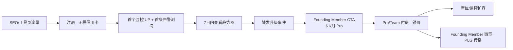

# PulseWatch — 定价与增长策略

**文档版本**：v1.1  
**关联文档**：[产品需求文档（PRD）](PRD.md)

---

## B. Freemium 模型与定价

### B.1 标准定价表（USD，年付享 20% 折扣）

> **早期获客阶段**：所有付费档执行 **1 折（Foundations Founding Member）** 计划，详见 [B.4 早期获客定价计划](#b4-早期获客定价计划early-access--launch-pricing)。

| 维度 | **Free** | **Pro** $12/月 | **Team** $39/月 | **Business** $99/月 |
|------|----------|----------------|-----------------|---------------------|
| 监控数量 | 15 | 50 | 150 | 500 |
| 检测间隔 | 5 分钟 | 1 分钟 | 60 秒 | 30 秒 |
| 探针区域 | 2（US-East, EU-West） | 5 | 12 | 全部 20+ |
| 历史保留 | 90 天 | 13 个月 | 24 个月 | 36 个月 |
| 告警渠道 | Email, Webhook | + Slack, Discord | + PagerDuty, MS Teams | + SMS 500 条/月 |
| 状态页 | 1（品牌水印） | 3 + 自定义子域 | 10 + 白标选项 | 无限 + SSO（路线图） |
| 团队成员 | 1 | 1 | 5 seats | 20 seats |
| API 速率 | 30 req/min | 120 req/min | 300 req/min | 1000 req/min |
| 异常检测 | 基础（SSL/响应时间阈值） | 完整基线学习 | + 多监控关联 | + 自定义 ML 灵敏度 |
| 维护窗口 | ❌ | ✅ | ✅ | ✅ |
| 商用 | ✅（≤$10k ARR 或 hobby） | ✅ | ✅ | ✅ |

**附加包**：SMS 超额 $0.05/条；额外 50 监控 +$8/月；额外状态页 +$5/月。

### B.4 早期获客定价计划（Early Access / Launch Pricing）

**目标**：在产品验证期以极低价格门槛换取用户规模、口碑与 PLG 传播，在增长阶段压制 UptimeRobot 等竞品的价格优势。

#### B.4.1 原价 vs 早期 1 折对比

| 套餐 | 标准月价（原价） | 早期 1 折月价 | 年付（1 折，无额外折扣） | 折扣幅度 |
|------|------------------|---------------|--------------------------|----------|
| **Free** | $0 | $0 | $0 | — |
| **Pro** | $12/月 | **$1/月** | $12/年 | 90% off |
| **Team** | $39/月 | **$4/月** | $48/年 | 90% off |
| **Business** | $99/月 | **$10/月** | $120/年 | 90% off |

> 取整说明：精确 1 折为 $1.20 / $3.90 / $9.90；对外展示采用 **$1 / $4 / $10**，便于记忆与传播（「Pro 功能只要 $1/月，比一杯咖啡还便宜」）。Stripe 实际扣款按取整价执行。

#### B.4.2 Founding Member 计划规则

| 维度 | 规则 |
|------|------|
| **资格窗口** | 上线起 **12 个月**内，或前 **5,000 名**付费订阅用户（以先达为准） |
| **价格锁定** | Founding Member **终身锁定 1 折月价**（Grandfather Clause），即使标准价上调也不受影响 |
| **身份标识** | 账户与账单页展示 **「Founding Member」** 徽章；状态页可选「Early Adopter」角标 |
| **免费层** | 功能不变；上线期额外赠送 **+3 监控配额**（18 个）与 **SSL Checker 历史保存 30 天**（常规 7 天） |
| **名额稀缺性** | 着陆页实时展示「剩余 Founding 名额：X / 5,000」；≤500 时切换为红色倒计时样式 |

**Sunset 里程碑（何时结束 1 折新用户招募）**：

1. 付费 Founding Member 达 **5,000 人**；或
2. 产品上线满 **12 个月**；或
3. MRR 达 **$30k** 且免费→付费转化率稳定 ≥ **5%**（连续 2 个月）

满足任一条件后：**新用户**恢复标准定价；**已锁定 Founding Member** 永久保留 1 折。

#### B.4.3 营销话术（中文，用于落地页 / 邮件 / 社媒）

| 场景 | 文案示例 |
|------|----------|
| Hero CTA | 「**Founding Member 限时 1 折** — Pro 全功能仅 **$1/月**，终身锁价」 |
| 稀缺性 | 「仅剩 **{n}** 个 Founding 名额 · 锁价后永不再涨」 |
| 价格锚点 | 「Pro 功能 **$1/月** — 比一杯咖啡还便宜（原价 $12）」 |
| 竞品对比 | 「UptimeRobot Solo $9/月仅 10 监控 · PulseWatch Pro **$1/月** 50 监控 + 商用友好」 |
| 升级触发 | 「你已用满 15 个免费监控 — **$1/月** 解锁 50 个 + 1 分钟检测」 |

**SEO 着陆页关键词（英文页面，中文策略备注）**：

| 目标关键词 | 落地页 |
|------------|--------|
| cheap website monitoring | `/` Hero + `/pricing` |
| affordable uptime monitor | `/pricing` |
| uptimerobot alternative cheap | `/compare/uptimerobot-alternative` |
| website monitoring $1 | `/pricing` Founding Member 区块 |

#### B.4.4 业务 rationale

| 策略 | 说明 |
|------|------|
| **压制 UptimeRobot** | Solo $9/月 vs PulseWatch Pro **$1/月** + 50 监控 + 允许商用 — 早期价格碾压 |
| **转化免费用户** | 免费层 15 监控触顶后，$1 升级几乎无决策摩擦，目标免费→付费 **8–12%**（早期） |
| **PLG 传播** | Founding Member 徽章 + 状态页 Early Adopter 标识 → 社交证明与 referral |
| **数据换价格** | 早期用户贡献监控数据、反馈与案例，换取极低 ARPU；12 月后逐步恢复标准价提升 LTV |
| **LTV 测算** | Founding Pro $1/月 × 24 月留存 ≈ $24 LTV；CAC 目标 < $8（有机 + 工具页为主） |

#### B.4.5 风险护栏（Abuse Prevention）

| 风险 | 防护措施 |
|------|----------|
| 多账户薅羊毛 | **1 邮箱 1 账户**；Founding 价仅限首次付费订阅；邮箱验证强制 |
| 批量注册 | 注册 IP 速率限制（5 次/小时）；可疑域名黑名单 |
| 信用卡滥用 | Stripe Radar 启用；同一卡绑定 ≤2 个 Founding 账户需人工审核 |
| 转售/代理 | ToS 禁止转售 Founding 席位；异常监控模式（>200 URL 单账户）触发审查 |
| 价格承诺 | **Grandfather Clause** 写入 ToS §4.2：Founding Member 订阅不中断则价格永不变 |
| 取消后复购 | 取消 Founding 订阅后 **30 天内**复订可恢复锁价；超 30 天按当时标准价 |

#### B.4.6 Stripe 实施备忘

```
产品 ID（标准价）          Founding Coupon / Price ID
─────────────────────────────────────────────────────
price_pro_monthly ($12)   price_pro_founding ($1)  + coupon FOUNDING_90（备用）
price_team_monthly ($39)  price_team_founding ($4)
price_biz_monthly ($99)   price_biz_founding ($10)
```

- 创建 Stripe **Coupon `FOUNDING_90`**：90% off，duration=`forever`，max_redemptions=5000（兜底）。
- 优先使用 **独立 Price ID**（`price_*_founding`）而非动态 Coupon，便于 Analytics 区分 cohort。
- Checkout Session metadata：`founding_member: true`、`founding_locked_at: ISO8601`。
- Webhook `customer.subscription.created` → 写入 `organizations.founding_member = true`。
- Customer Portal：**禁止** Founding Member 自助切换至标准价套餐（防误操作丢锁价）。

### B.2 定价心理学与转化漏斗



**Founding Member 转化触点**：

| 触点 | 位置 | CTA 文案 |
|------|------|----------|
| 着陆页 Hero | `/` 首屏 | 「Become a Founding Member — Pro for $1/mo, locked forever」 |
| 定价页 | `/pricing` | 标准价划线 + 1 折价高亮 + 剩余名额计数器 |
| 升级弹窗 | 第 16 个监控 / 1 分钟间隔 | 「Upgrade to Pro for just $1/mo — Founding price ends soon」 |
| 仪表盘 Banner | 免费用户 D3+ | 「🎉 Founding Member: 50 monitors, 1-min checks — $1/mo lifetime」 |
| 邮件 D7 | 趋势报告邮件 | 「Your sites had 99.2% uptime — lock $1/mo Pro before spots run out」 |
| 结账页 | Stripe Checkout | 显示 Founding Member 徽章预览 + 「Price locked forever」 |

**关键升级触发器（产品内提示）**：

| 触发事件 | 推荐套餐 | 文案示例 |
|----------|----------|----------|
| 创建第 16 个监控 | Pro | "You've reached the free limit. **Founding Member: 50 monitors for $1/mo** — locked forever." |
| 需要 1 分钟间隔 | Pro | "Detect outages 5× faster with Pro. **Early price: $1/mo** (was $12)." |
| 需要 Slack 告警 | Pro | "Route alerts to #incidents in 1 click. **$1/mo Founding offer.**" |
| 添加第 2 个团队成员 | Team | "Collaborate with on-call rotations. **Team $4/mo** — Founding price." |
| 自定义域名状态页 | Pro/Team | "Build trust with status.yourbrand.com — **from $1/mo**." |
| 需要 SMS | Business | "Wake up on-call when email isn't enough. **Business $10/mo** Founding." |

**转化设计**：注册后引导创建 1 个监控 + 发送测试告警；第 3 天邮件展示「过去 7 天 p95 趋势」+ Founding 优惠；第 14 天若监控 ≥10 展示 Team Founding 价（$4/月）对比标准价 $39。

### B.3 竞品定价参考（2025–2026）

| 竞品 | 入门付费 | 备注 |
|------|----------|------|
| UptimeRobot Solo | $9/月 | 仅 10 监控；免费层禁止商用 |
| Better Stack Responder | $29/月 | 含事件管理，按量加监控 |
| StatusCake Superior | ~$16/月 | 30+ 国家探针 |
| Pingdom | $15/月起 | 无免费层 |
| Site24x7 Web Uptime | $9/月 | 5 免费基础监控 |
| Datadog Synthetic API | $5/万运行 | 按运行计费 |

**PulseWatch 定价策略**：

- **标准期**：略低于 StatusCake Team 档位，高于 UptimeRobot Solo 但监控数与商用政策更优。
- **早期获客期（Founding Member）**：Pro **$1/月** 直接碾压 UptimeRobot Solo **$9/月**（5× 监控数 + 商用友好），以价格换规模；Team/Business 同理形成「不可能拒绝的升级」。

#### 早期 vs 竞品价格对比

| 对比项 | UptimeRobot Solo | PulseWatch Pro（Founding） | PulseWatch Pro（标准） |
|--------|------------------|----------------------------|------------------------|
| 月价 | $9 | **$1** | $12 |
| 监控数 | 10 | **50** | 50 |
| 检测间隔 | 60 秒 | **1 分钟** | 1 分钟 |
| 商用 | ✅ | ✅ | ✅ |
| 价格锁定 | ❌ | **✅ 终身** | ❌ |

---

## F. SEO 与用户获取策略

### F.1 着陆页结构（英文 SEO）

| URL | 目标关键词 | 内容要点 |
|-----|------------|----------|
| `/` | website uptime monitoring, uptime checker, **cheap website monitoring** | Hero CTA（Founding Member $1/mo）、社会证明、对比表、剩余名额 |
| `/pricing` | uptime monitoring pricing, **affordable uptime monitor**, **website monitoring $1** | 原价划线 + 1 折价、Founding FAQ schema、名额计数器 |
| `/features/ssl-monitoring` | ssl certificate expiry monitor | 功能详解 + demo |
| `/features/status-page` | free status page | 模板截图 |
| `/compare/uptimerobot-alternative` | uptimerobot alternative, **uptimerobot alternative cheap** | 公正对比、$1 vs $9 价格表、商用免费亮点 |
| `/tools/ssl-checker` | ssl checker, certificate expiry check | **Lead magnet**，无需注册可用，注册保存历史 |
| `/tools/uptime-calculator` | downtime cost calculator | 互动计算器 → 邮件收集 |
| `/blog` | how to monitor website uptime | 教程、清单、案例 |

**技术 SEO**：Next.js SSR、`hreflang` 预留、JSON-LD（SoftwareApplication、FAQPage）、Core Web Vitals < 2.5s LCP、sitemap.xml 每日更新。

### F.2 内容策略

| 类型 | 频率 | 示例标题 |
|------|------|----------|
| 教程 | 2/月 | "How to Monitor Stripe Webhooks with HTTP Checks" |
| 对比 | 1/月 | "PulseWatch vs UptimeRobot (2026)" |
| 清单 | 1/季 | "Production Launch Monitoring Checklist (PDF)" |
| 工具页 | 持续 | SSL Checker、DNS Lookup、Redirect Chain Analyzer |

### F.3 Product-Led Growth 钩子

1. **Founding Member 徽章**：状态页与公开 profile 展示「Early Adopter · PulseWatch Founding Member」→ 社交证明 + 好奇点击。
2. 状态页 `Powered by` → 带 UTM 的注册链接 + referral 计划（推荐付费送 1 月 Pro；Founding 期双方各延 1 月锁价）。
3. 告警邮件 footer：「Create your free monitor — **Founding: Pro $1/mo**」。
4. 公开「行业正常运行时间」聚合页（匿名化）→ 外链与品牌。
5. GitHub Action：CI 中插入监控 badge SVG（Founding Member 专属金色 badge 样式）。
6. 免费层 API 只读状态页嵌入第三方站点。

### F.4 目录与社区

- 提交：Product Hunt、G2、Capterra、AlternativeTo、SaaSHub。
- 社区：Indie Hackers、r/selfhosted 对比帖、Dev.to 教程。
- 集成市场：Slack App Directory、Vercel Marketplace（Phase 2）。

### F.5 获客漏斗指标目标

| 指标 | 目标 |
|------|------|
| 有机注册占比 | 6 个月内 ≥ 40% |
| 工具页 → 注册 | SSL Checker ≥ 8% |
| 状态页 referral 注册 | 每月 ≥ 50 |
| CAC（付费渠道） | < 3 个月 LTV 回收 |
| **Founding Member 转化** | 免费→Founding 付费 **8–12%**（早期 6 个月） |
| **Founding 名额消耗** | 上线 90 天内 ≥ 1,000 付费 Founding |

---

## 相关文档

- [产品需求文档（PRD）](PRD.md)
- [技术设计规格书](TECHNICAL-DESIGN.md)
- [路线图与指标](ROADMAP.md)
