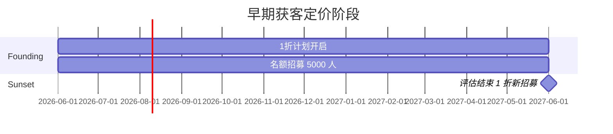

# PulseWatch — 路线图与指标

**文档版本**：v1.2  
**关联文档**：[产品需求文档（PRD）](PRD.md) | [技术设计规格书](TECHNICAL-DESIGN.md) | [差距清单](GAP-BACKLOG.md)

---

## G. MVP 范围与路线图

### G.1 Phase 1 — MVP（8–12 周）

**必须交付（P0）** — 与代码对照见 [GAP-BACKLOG.md](GAP-BACKLOG.md)：

- [x] Email + 密码注册登录；Google/GitHub OAuth（需 env）
- [x] **Premium UI**：Next.js 15 + Tailwind 4 暗色主题（自定义组件，非 shadcn 包）
- [x] **Landing Page**：Hero、定价、Founding CTA；Live Demo 为静态预览（🔶）
- [x] **用户管理 MVP**：Personal Org、Profile/密码/Email
- [x] **RBAC 基础**：Owner/Member/Viewer；团队邀请已扩展（超出原 MVP 范围）
- [x] **Monitors**：列表、筛选、Wizard、详情、编辑 PATCH config
- [x] HTTP/TCP/Ping/Keyword/SSL + 扩展类型（DNS、Heartbeat 等）
- [x] 多区域检查与 N-of-M（真地理探针需 `PROBE_DISPATCH` + worker，🔶）
- [x] 邮件 + Webhook + 多集成渠道（部分需 env）
- [x] Dashboard、Incidents、事件协作
- [x] 状态页（自定义域字段有，全自动 DNS/证书需运维，🔶）
- [x] Stripe 双价轨（需 `STRIPE_*`，🔶）
- [x] Founding Member 字段与徽章
- [x] SSL Checker 工具页
- [ ] **90 天数据保留 + 降采样** — PostgreSQL 分区表已用，**自动 TTL/降采样未实现**
- [x] 登录失败 lockout（5 次 / 15 分钟，email + IP）
- [x] Session 列表与撤销（Security 设置页）
- [ ] **无障碍**：核心流程可访问；**axe Playwright CI 未门禁**（🔶）

**原 MVP 排除项中已部分交付**（文档以 [ISSUES.md](ISSUES.md) 为准）：SMS、DNS、2FA、⌘K、团队、PagerDuty/Slack 等 — 见 Phase 2–5。

**仍不在范围或未完成**：

- API JSON 监控类型（PRD Pro+）
- 官方 Terraform Provider（仅示例 client）
- 真 Chromium 故障截图 + S3

### G.1.1 早期获客定价阶段（Phase 1 同步启动）

| 里程碑 | 时间 | 交付 |
|--------|------|------|
| **Launch Week** | MVP 上线 | Founding Member 计划开启；着陆页 + `/pricing` 1 折价上线 |
| **Month 1–3** | 验证期 | 目标 500 Founding 付费；免费→Founding 转化 ≥ 8% |
| **Month 3–6** | 增长期 | 目标 2,000 Founding；SEO 工具页 + UptimeRobot 对比页引流 |
| **Month 6–12** | 规模期 | 目标 5,000 Founding 或 MRR $30k → 评估 Sunset |
| **Sunset** | 达标后 | 新用户恢复标准价；Founding Member 永久保留 1 折 |

### G.2 Phase 2（+8 周）

- **Team 套餐与完整 RBAC**：成员邀请、角色分配、Org Switcher、审计日志
- **账户安全增强**：2FA TOTP、Session 管理 UI、Magic Link 登录
- **UI polish Phase 2**：⌘K 命令面板、Monitor 详情 Drawer、批量操作、Onboarding 优化
- Team 套餐、Slack/Discord、60s/30s 间隔、5+ 区域
- 维护窗口、SLA PDF 报告、p95 异常检测
- 自定义域状态页、Discord 社区机器人
- API Keys 管理 UI、通知偏好页

### G.3 Phase 3（+12 周）

- Business：SMS、PagerDuty、SSO
- API JSON 监控、Heartbeat、Terraform Provider
- 关联异常、高级白标、SOC2 准备
- 可选：轻量移动 Web PWA

---

## H. 指标与成功标准

### H.1 North Star Metric

**每周活跃监控数（WAM）**：过去 7 天至少收到 1 次成功检查的监控总数。  
理由：直接反映产品核心价值交付。

### H.2 激活与留存

| 指标 | 定义 | MVP 目标（90 天） |
|------|------|-------------------|
| 注册 → 首个监控 | 24h 内创建 | ≥ 45% |
| 激活 | 首个监控 + 验证邮箱 + 查看仪表盘 | ≥ 35% |
| D7 留存 | 第 7 天仍有活跃监控 | ≥ 25% |
| D30 留存 | 第 30 天仍登录 | ≥ 15% |

### H.3 转化与收入

| 指标 | 目标 |
|------|------|
| 免费 → 付费转化率 | **8–12%**（Founding 期，6 个月内）；Sunset 后恢复 4–6% |
| 试用 → 付费（若启用 Team 试用） | 25% |
| MRR | MVP+90d: **$3k**（Founding 低 ARPU）；12 月: **$30k**（含 Sunset 后标准价 uplift） |
| ARPU | Founding 期 Pro ~$1–4；Sunset 后 Pro ~$12, Team ~$39 |
| **Founding Member 数量** | 90 天内 ≥ 1,000；12 月内 ≤ 5,000（锁价 cohort） |
| Churn（月度） | < 5% logo churn |

### H.4 增长与 SEO

| 指标 | 目标 |
|------|------|
| 有机注册占比 | 6 个月内 ≥ 40% |
| 工具页 → 注册 | SSL Checker ≥ 8% |
| 状态页 referral 注册 | 每月 ≥ 50 |
| CAC（付费渠道） | < 3 个月 LTV 回收 |

### H.5 平台质量

| 指标 | 目标 |
|------|------|
| 误报率（用户标记） | < 2% |
| 告警投递成功率 | > 99.5% |
| NPS | ≥ 40 |

---

## 实施优先级总结

| 周次 | 交付物 |
|------|--------|
| 1–2 | 架构脚手架、设计系统（shadcn/ui + 主题 Token）、Auth、Landing Page 骨架 |
| 3–4 | Monitor CRUD、PostgreSQL RBAC 表、Monitors 列表/创建 Wizard UI |
| 5–6 | 探针 Agent v1、调度器、CheckResult 写入 **PostgreSQL 分区表** |
| 7–8 | 告警引擎、Dashboard 图表、Incident 状态机、Settings 页（Profile/Security） |
| 9–10 | 状态页、Stripe（**Founding + 标准双 Price**）、SSL 工具、Landing（**Founding CTA + 名额计数器**）、响应式 Mobile |
| 11–12 | 多区域聚合、降采样、Onboarding 优化、无障碍测试、Beta 与 Product Hunt |

---

## 文档结论

PulseWatch 定位在 UptimeRobot 商用限制与 Better Stack 复杂度之间的**甜蜜点**——对开发者友好的免费层、可预测定价、内置趋势与异常洞察，并以 SEO 工具矩阵驱动可持续获客。早期通过 **Founding Member 1 折计划**（Pro $1/月终身锁价）快速获取种子用户，Sunset 后恢复标准价提升 LTV。

技术方案采用 **PostgreSQL + ClickHouse + Redis + 分布式 Go 探针**，可在 8–12 周内交付可收费的 MVP，并为 Team/Business 能力预留清晰扩展路径。

---

## 相关文档

- [产品需求文档（PRD）](PRD.md)
- [UI/UX 设计规范](UI-UX-DESIGN.md)
- [用户与权限管理](USER-MANAGEMENT.md)
- [技术设计规格书](TECHNICAL-DESIGN.md)
- [定价与增长策略](PRICING-AND-GROWTH.md)
