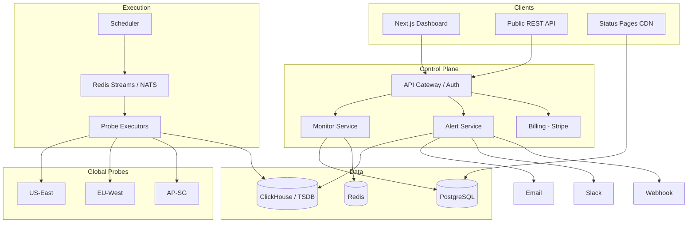
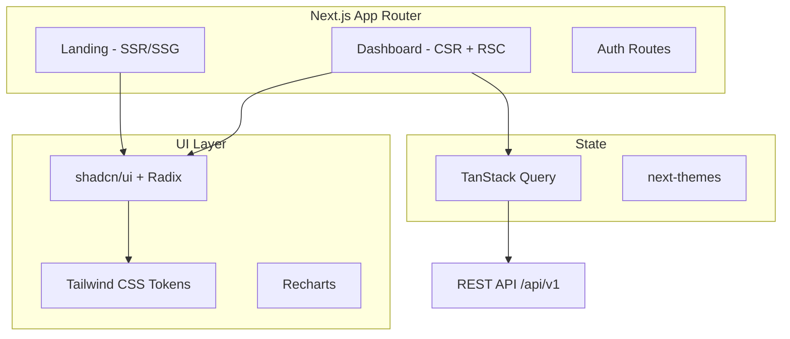
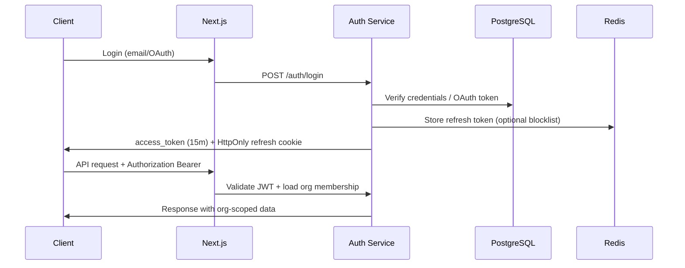
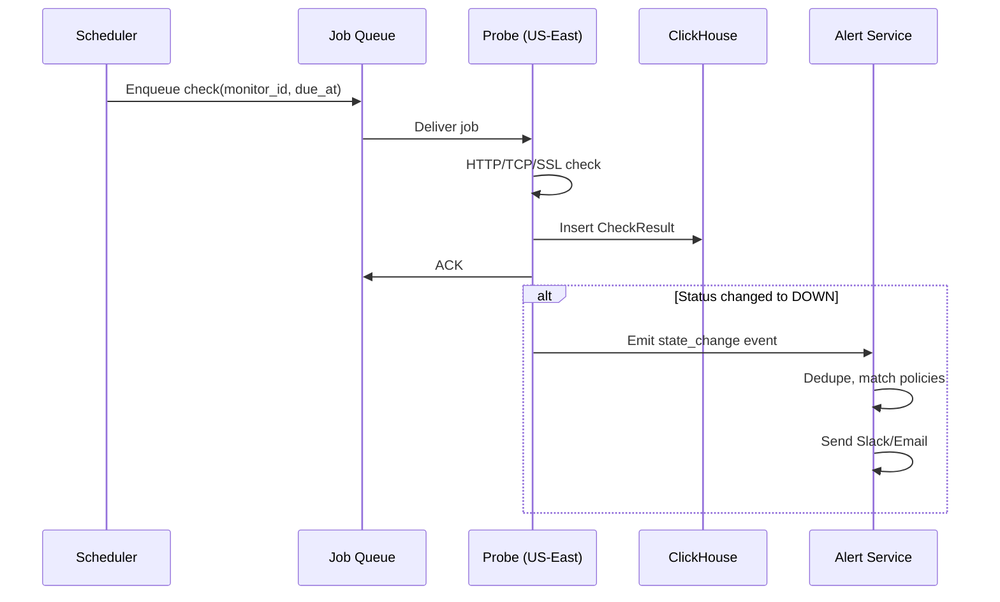
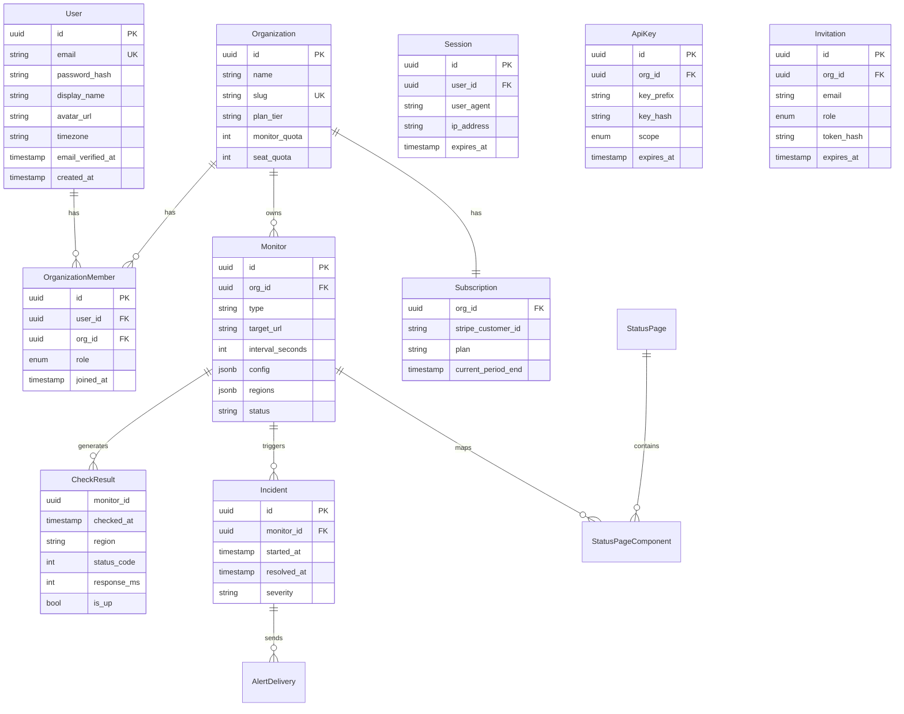
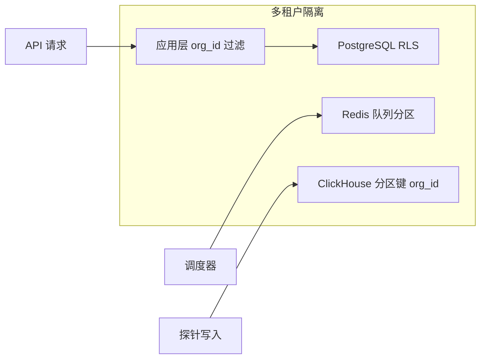

# PulseWatch — 技术设计规格书

**文档版本**：v1.1  
**关联文档**：[产品需求文档（PRD）](PRD.md)

> **实现说明（2026-05）**：MVP 已落地为 **Go API + Next.js 15 + PostgreSQL 分区表**；**不使用 ClickHouse**。时序数据写入 PostgreSQL `check_results`（按月分区）。前端支持 **next-intl 中英文（en/zh）**，浏览器 `Accept-Language` 自动检测 + Cookie 持久化。详见 [DEPLOYMENT.md](../DEPLOYMENT.md)。

---

## E. 技术架构设计

### E.1 高层架构



### E.2 技术栈建议

| 层级 | 技术选型 | 理由 |
|------|----------|------|
| 前端 | Next.js 15 (App Router) + React 19 + Tailwind CSS 4 + shadcn/ui | SEO SSR、英文市场主流、Premium UI 组件 |
| 前端状态 | TanStack Query + Zustand | 服务端状态缓存 + 轻量客户端 UI 状态 |
| 图表 | Recharts 或 Tremor | 与 shadcn 风格统一 |
| 主题 | next-themes | 暗/亮模式无闪烁切换 |
| API | Go (Fiber/Chi) 或 Node (Fastify) | 高并发、低延迟调度接口 |
| 认证 | Auth.js (NextAuth v5) 或自研 JWT + OAuth | 快速 OAuth；与 Next.js 深度集成 |
| 关系库 | PostgreSQL 16 | 用户、监控、订阅、Incident |
| 缓存/队列 | Redis 7 + Redis Streams | 调度锁、去重、短期状态 |
| 时序库 | ClickHouse 或 TimescaleDB | 海量 CheckResult、百分位查询 |
| 探针 Agent | Go 单二进制 | 轻量、跨平台、易部署到 VPS |
| 邮件 | Resend / Postmark | 送达率、模板 |
| 计费 | Stripe Billing | 订阅、用量、门户 |
| 基础设施 | AWS/GCP + Fly.io 边缘探针 | 多区域 |
| 可观测 | Grafana + Prometheus + Sentry | 狗食 |

#### 前端架构（Premium UI）



**目录结构建议**：

```text
apps/web/
├── app/
│   ├── (marketing)/          # Landing, Pricing, Tools
│   ├── (auth)/               # login, signup, forgot-password
│   ├── (dashboard)/          # 需认证
│   │   ├── dashboard/
│   │   ├── monitors/
│   │   ├── incidents/
│   │   ├── status-pages/
│   │   └── settings/
│   └── layout.tsx
├── components/
│   ├── ui/                   # shadcn 生成
│   ├── monitors/
│   └── charts/
└── lib/
    ├── api-client.ts
    └── permissions.ts
```

**UI 规范**：详见 [UI/UX 设计规范](UI-UX-DESIGN.md)。

### E.2.1 认证架构



| 组件 | 职责 |
|------|------|
| **Access Token** | JWT 15min；claims: `sub`, `email`, `org_id`, `role` |
| **Refresh Token** | HttpOnly Secure SameSite=Lax cookie；30d |
| **OAuth** | Google + GitHub；Auth.js 或自研 callback |
| **Password** | Argon2id 哈希 |
| **Session Store** | PostgreSQL `sessions` 表 + Redis 黑名单 |
| **Email Verify** | 一次性 token，SHA-256 哈希存储 |
| **Rate Limit** | Redis：登录 5/min/IP；邀请 10/hour/org |

**Middleware 链**（API Gateway）：

1. JWT 验证 → 解析 `user_id`
2. 解析 `X-Org-Id` header → 校验 `organization_members`
3. RBAC 检查 `required_permission`
4. 注入 `ctx.org_id`, `ctx.role` 到请求上下文

### E.3 监控执行引擎



**调度算法**：

1. 每个 `monitor_id` 维护 `next_run_at`。
2. Scheduler 分片（按 `monitor_id hash`）多实例，Redis 分布式锁防重复。
3. 任务 payload：`{monitor_id, regions[], config_snapshot_version}`。
4. 探针拉取或推送结果；**Aggregator** 合并多区域结果为单一状态。
5. 状态机：`UP → DOWN` 需连续失败策略；`DOWN → UP` 需连续成功 1–2 次。

### E.4 数据模型



**ClickHouse 表（示例）**：`check_results` 按 `(org_id, monitor_id, date)` 分区；物化视图预聚合 `uptime_5m`、`latency_percentiles_1h`。

#### PostgreSQL 核心实体说明

| 实体 | 职责 |
|------|------|
| **User** | 用户账户，Email/OAuth 认证 |
| **Organization** | 租户主体，承载订阅与配额 |
| **OrganizationMember** | 用户与组织的 RBAC 关系 |
| **Session** | 登录会话，支持撤销 |
| **ApiKey** | 组织级 API 密钥，scope 分权 |
| **Invitation** | 待接受的团队成员邀请 |
| **Monitor** | 监控配置快照（类型、目标、间隔、区域） |
| **Incident** | 故障事件生命周期 |
| **AlertDelivery** | 告警投递记录与状态 |
| **StatusPage** | 公开状态页配置 |
| **StatusPageComponent** | 状态页与监控的映射关系 |
| **Subscription** | Stripe 订阅状态 |

#### ClickHouse 时序数据

**`check_results` 表结构（示例）**：

```sql
CREATE TABLE check_results (
    org_id       UUID,
    monitor_id   UUID,
    checked_at   DateTime64(3),
    region       LowCardinality(String),
    status_code  UInt16,
    response_ms  UInt32,
    is_up        UInt8,
    dns_ms       UInt32,
    tcp_ms       UInt32,
    tls_ms       UInt32,
    ttfb_ms      UInt32
) ENGINE = MergeTree()
PARTITION BY (org_id, toYYYYMM(checked_at))
ORDER BY (monitor_id, checked_at);
```

**物化视图**：

- `uptime_5m`：5 分钟粒度 uptime 聚合
- `latency_percentiles_1h`：1 小时粒度 p50/p95/p99 延迟

### E.5 异常检测实现

**Phase 1（MVP）**：

```text
baseline_p95 = median(last 7 days, same hour bucket)
if current_p95 > baseline_p95 * 1.5 AND current_p95 > 500ms:
    emit anomaly_event(severity=warning)
```

**Phase 2**：每日离线作业，按 monitor 拟合 seasonal decomposition；在线流式用 EWMA + 3σ。

**SSL**：每日 00:00 UTC 批量探测；`days_to_expiry` 写入 `monitor_metadata`。

#### 异常检测类型与实现路径

| 类型 | MVP 实现 | Phase 2 增强 |
|------|----------|--------------|
| 响应时间尖峰 | 7 天滚动基线 + 3σ 或 MAD | Holt-Winters 季节性分解 |
| 可用性模式 | 同比同时段 downtime 频率统计 | 离线批处理 + 周报 |
| SSL 到期 | 固定阈值 30/14/7/1 天 | 链完整性深度检测 |
| 慢响应渐变 | 7 日 p95 上升 >40% | EWMA 流式检测 |
| 关联异常 | — | 同 ASN/托管商多监控关联（Isolation Forest） |

### E.5.1 RBAC 数据模型

#### 角色枚举

```sql
CREATE TYPE member_role AS ENUM ('owner', 'admin', 'member', 'viewer');
CREATE TYPE api_key_scope AS ENUM ('read', 'write', 'admin');
```

#### 核心表 DDL（PostgreSQL）

```sql
CREATE TABLE users (
    id                UUID PRIMARY KEY DEFAULT gen_random_uuid(),
    email             VARCHAR(255) NOT NULL UNIQUE,
    password_hash     VARCHAR(255),          -- OAuth-only 用户可为 NULL
    display_name      VARCHAR(64),
    avatar_url        TEXT,
    timezone          VARCHAR(64) DEFAULT 'UTC',
    email_verified_at TIMESTAMPTZ,
    created_at        TIMESTAMPTZ NOT NULL DEFAULT now(),
    updated_at        TIMESTAMPTZ NOT NULL DEFAULT now()
);

CREATE TABLE organizations (
    id             UUID PRIMARY KEY DEFAULT gen_random_uuid(),
    name           VARCHAR(128) NOT NULL,
    slug           VARCHAR(64) NOT NULL UNIQUE,
    plan_tier      VARCHAR(32) NOT NULL DEFAULT 'free',
    monitor_quota  INT NOT NULL DEFAULT 15,
    seat_quota     INT NOT NULL DEFAULT 1,
    created_at     TIMESTAMPTZ NOT NULL DEFAULT now()
);

CREATE TABLE organization_members (
    id         UUID PRIMARY KEY DEFAULT gen_random_uuid(),
    user_id    UUID NOT NULL REFERENCES users(id) ON DELETE CASCADE,
    org_id     UUID NOT NULL REFERENCES organizations(id) ON DELETE CASCADE,
    role       member_role NOT NULL DEFAULT 'member',
    joined_at  TIMESTAMPTZ NOT NULL DEFAULT now(),
    UNIQUE (user_id, org_id)
);

CREATE TABLE sessions (
    id           UUID PRIMARY KEY DEFAULT gen_random_uuid(),
    user_id      UUID NOT NULL REFERENCES users(id) ON DELETE CASCADE,
    refresh_hash VARCHAR(255) NOT NULL,
    user_agent   TEXT,
    ip_address   INET,
    expires_at   TIMESTAMPTZ NOT NULL,
    created_at   TIMESTAMPTZ NOT NULL DEFAULT now()
);

CREATE TABLE api_keys (
    id          UUID PRIMARY KEY DEFAULT gen_random_uuid(),
    org_id      UUID NOT NULL REFERENCES organizations(id) ON DELETE CASCADE,
    name        VARCHAR(128) NOT NULL,
    key_prefix  VARCHAR(16) NOT NULL,
    key_hash    VARCHAR(255) NOT NULL,
    scope       api_key_scope NOT NULL DEFAULT 'read',
    last_used_at TIMESTAMPTZ,
    expires_at  TIMESTAMPTZ,
    created_by  UUID REFERENCES users(id),
    created_at  TIMESTAMPTZ NOT NULL DEFAULT now()
);

CREATE TABLE invitations (
    id          UUID PRIMARY KEY DEFAULT gen_random_uuid(),
    org_id      UUID NOT NULL REFERENCES organizations(id) ON DELETE CASCADE,
    email       VARCHAR(255) NOT NULL,
    role        member_role NOT NULL DEFAULT 'member',
    token_hash  VARCHAR(255) NOT NULL,
    invited_by  UUID REFERENCES users(id),
    expires_at  TIMESTAMPTZ NOT NULL,
    accepted_at TIMESTAMPTZ,
    created_at  TIMESTAMPTZ NOT NULL DEFAULT now()
);
```

#### RBAC 权限检查（应用层）

```text
func RequirePermission(ctx, perm Permission) error {
    role := ctx.Role  // from organization_members
    if !rolePermissions[role].Contains(perm) {
        return ErrForbidden
    }
    return nil
}
```

**角色 → 权限映射** 见 [用户与权限管理](USER-MANAGEMENT.md) 第 3 节。

#### PostgreSQL RLS 策略（示例）

```sql
ALTER TABLE monitors ENABLE ROW LEVEL SECURITY;

CREATE POLICY monitors_org_isolation ON monitors
    USING (org_id IN (
        SELECT org_id FROM organization_members
        WHERE user_id = current_setting('app.user_id')::UUID
    ));
```

API 层在每个请求开始时：`SET LOCAL app.user_id = '<uuid>'`。

### E.6 多租户设计

- 所有表含 `org_id`；Row Level Security（PostgreSQL）或应用层中间件强制过滤。
- API Key 绑定 `org_id` + scope。
- 免费层速率：创建监控 10/hour；API 30 req/min。
- noisy neighbor：按 org 分队列优先级（付费更高权重）。

#### 租户隔离层级



#### 速率限制策略

| 层级 | 创建监控 | API 速率 | 队列优先级 |
|------|----------|----------|------------|
| Free | 10/hour | 30 req/min | 低 |
| Pro | 50/hour | 120 req/min | 中 |
| Team | 200/hour | 300 req/min | 高 |
| Business | 无限制 | 1000 req/min | 最高 |

---

## 相关文档

- [产品需求文档（PRD）](PRD.md)
- [UI/UX 设计规范](UI-UX-DESIGN.md)
- [用户与权限管理](USER-MANAGEMENT.md)
- [定价与增长策略](PRICING-AND-GROWTH.md)
- [路线图与指标](ROADMAP.md)
