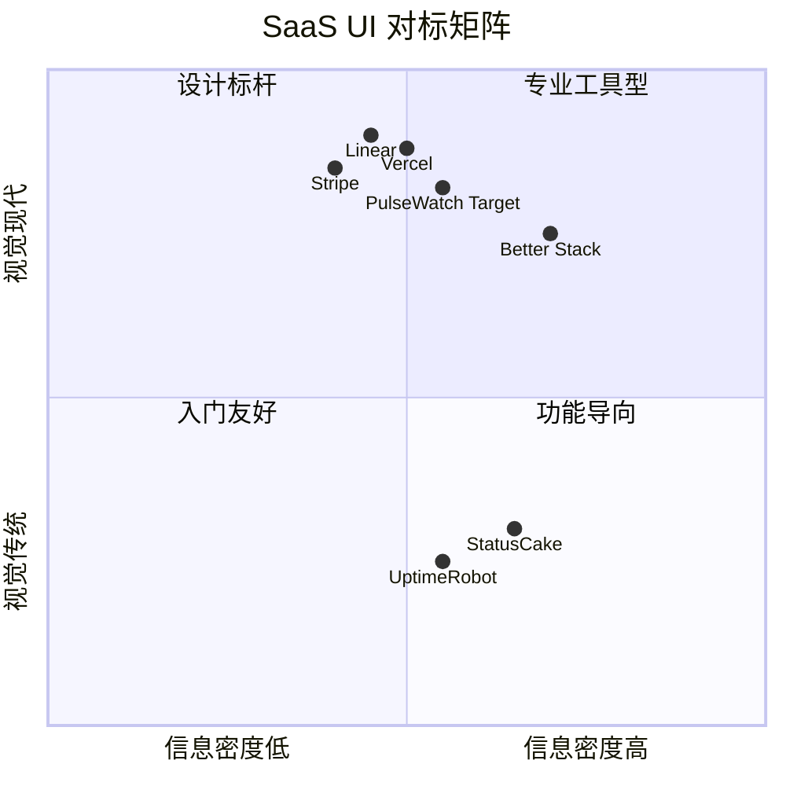
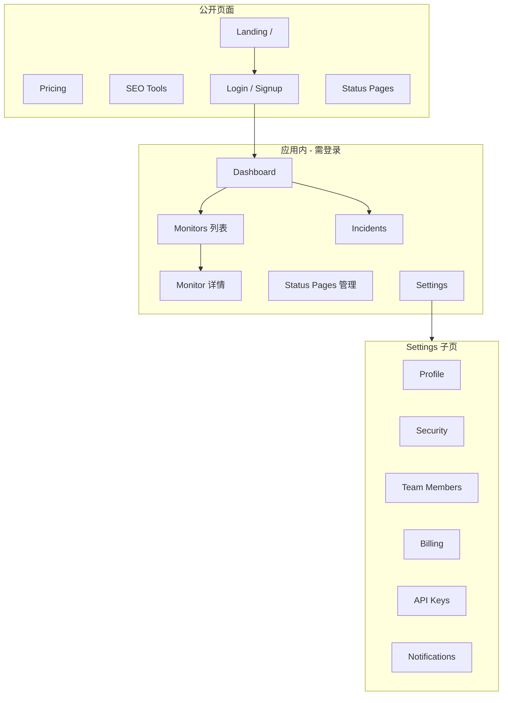
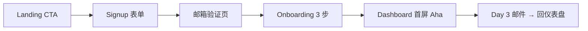

# PulseWatch — UI/UX 设计规范

**文档版本**：v1.0  
**产品语言**：英文（UI 文案面向全球市场）  
**关联文档**：[产品需求文档（PRD）](PRD.md) | [用户与权限管理](USER-MANAGEMENT.md) | [技术设计规格书](TECHNICAL-DESIGN.md)

---

## 1. 设计哲学与参考

### 1.1 核心原则

PulseWatch 的界面应让用户在 **3 分钟内完成首个监控**，同时传递 **企业级可信度**。设计目标不是「功能堆砌」，而是 **清晰、克制、高转化**。

| 原则 | 说明 | 参考实践 |
|------|------|----------|
| **Clarity over density** | 一屏只传达一个主任务；数据可视化优先于表格堆砌 | Linear 列表 + 详情抽屉 |
| **Developer-first polish** | 暗色模式默认、等宽数字、精确到 ms 的指标展示 | Vercel Dashboard |
| **Trust at first glance** | 着陆页社会证明、实时 uptime 演示、透明定价 | Stripe Marketing |
| **Progressive disclosure** | 基础监控 3 步完成；高级选项折叠在「Advanced」 | Better Stack Monitor 创建流 |
| **Conversion by design** | 每个功能页都有明确 CTA；免费层价值前置 | Better Stack / Vercel 定价页 |

### 1.2 竞品 UI 对标



**PulseWatch 目标区间**：Modern + Medium density — 比 UptimeRobot 更精致，比 Better Stack 更聚焦监控场景，视觉语言接近 Linear/Vercel 的开发者审美。

### 1.3 品牌调性

- **语气**：专业、直接、不贩卖焦虑（避免红色恐慌式告警 UI，DOWN 状态用琥珀/珊瑚色而非纯红轰炸）
- **motion**：有目的的微动效（状态切换、图表加载），禁止装饰性动画
- **图标**：Lucide Icons（与 shadcn/ui 一致），16/20/24px 三档

---

## 2. 设计系统（Design System）

### 2.1 色彩

采用 **语义化 Token**，支持亮/暗双主题，CSS 变量驱动（Tailwind + shadcn/ui 约定）。

#### 品牌色

| Token | Light | Dark | 用途 |
|-------|-------|------|------|
| `--brand-primary` | `#0066FF` | `#3B82F6` | 主 CTA、链接、选中态 |
| `--brand-primary-hover` | `#0052CC` | `#2563EB` | 按钮 hover |
| `--brand-accent` | `#00D4AA` | `#34D399` | UP 状态、正向指标 |
| `--brand-warning` | `#F59E0B` | `#FBBF24` | 降级、SSL 即将到期 |
| `--brand-danger` | `#EF4444` | `#F87171` | DOWN、Incident 开放 |
| `--brand-muted` | `#64748B` | `#94A3B8` | 次要文字、禁用 |

#### 表面与边框（参考 Linear）

| Token | Light | Dark |
|-------|-------|------|
| `--background` | `#FAFAFA` | `#0A0A0B` |
| `--surface` | `#FFFFFF` | `#141416` |
| `--surface-elevated` | `#FFFFFF` + shadow | `#1C1C1F` |
| `--border` | `#E4E4E7` | `#27272A` |
| `--border-subtle` | `#F4F4F5` | `#1F1F23` |

#### 状态色语义

| 状态 | 色值 | 图标 | 使用场景 |
|------|------|------|----------|
| UP | `#10B981` | `CircleCheck` | 监控列表圆点、仪表盘 KPI |
| DOWN | `#EF4444` | `CircleX` | Incident 横幅、列表徽章 |
| PAUSED | `#71717A` | `CirclePause` | 维护窗口 |
| PENDING | `#F59E0B` | `Loader2`（spin） | 首次检查中 |
| DEGRADED | `#F59E0B` | `AlertTriangle` | 部分区域失败 |

### 2.2 字体

| 用途 | 字体 | 回退 |
|------|------|------|
| UI / 正文 | **Inter** | system-ui, sans-serif |
| 代码 / URL / 指标 | **JetBrains Mono** | ui-monospace, monospace |
| 着陆页 Display | **Inter**（tracking -0.02em） | — |

**字号阶梯**（Tailwind 映射）：

| 级别 | 大小 | 行高 | 用途 |
|------|------|------|------|
| `text-xs` | 12px | 16px | 徽章、时间戳 |
| `text-sm` | 14px | 20px | 表格、表单标签 |
| `text-base` | 16px | 24px | 正文 |
| `text-lg` | 18px | 28px | 卡片标题 |
| `text-xl` | 20px | 28px | 区块标题 |
| `text-2xl` | 24px | 32px | 页面标题 |
| `text-4xl` | 36px | 40px | 着陆页 Hero |
| `text-6xl` | 60px | 1 | 着陆页大标题（desktop） |

**数字展示**：uptime %、延迟 ms 使用 `font-mono tabular-nums`，确保表格对齐。

### 2.3 间距与布局

- **基础单位**：4px grid（Tailwind 默认）
- **页面最大宽度**：Landing `max-w-7xl`（1280px）；Dashboard `max-w-[1600px]`
- **侧边栏宽度**：展开 240px / 折叠 64px（参考 Linear）
- **卡片内边距**：`p-4`（compact）/ `p-6`（default）
- **区块间距**：`space-y-6`（页面级）/ `gap-4`（网格）

### 2.4 圆角与阴影

| Token | 值 | 用途 |
|-------|-----|------|
| `--radius-sm` | 6px | 按钮、输入框 |
| `--radius-md` | 8px | 卡片 |
| `--radius-lg` | 12px | 模态框、大卡片 |
| `--shadow-sm` | `0 1px 2px rgba(0,0,0,0.05)` | 卡片默认 |
| `--shadow-md` | `0 4px 12px rgba(0,0,0,0.08)` | Dropdown、Popover |

### 2.5 核心组件库

基于 **shadcn/ui + Radix UI**，确保无障碍与键盘导航。

| 组件 | 变体 / 规范 |
|------|-------------|
| **Button** | `default` / `secondary` / `ghost` / `destructive`；主 CTA 仅每屏 1 个 |
| **Badge** | UP/DOWN/PAUSED 语义色；`outline` 用于标签 |
| **Card** | 默认 `border` + 无 shadow；hover 时 `shadow-sm`（列表项） |
| **DataTable** | TanStack Table；固定首列（监控名）；虚拟滚动 >100 行 |
| **Chart** | Recharts 或 Tremor；统一 tooltip 样式 |
| **Command** | ⌘K 全局搜索（Phase 2） |
| **Sheet / Drawer** | 监控详情右侧滑出（desktop）；全屏（mobile） |
| **Toast** | Sonner；告警测试成功 / 保存成功 |
| **Empty State** | 插画 + 主 CTA + 文档链接（参考 Vercel 空项目页） |

---

## 3. 信息架构



---

## 4. 页面线框与交互说明

### 4.1 Landing Page（`/`）

**目标**：8 秒内传达价值，注册转化率 ≥ 5%。

#### 结构（自上而下）

| 区块 | 内容 | 设计要点 |
|------|------|----------|
| **Nav** | Logo、Features、Pricing、Docs、Login、**Start free** CTA | 透明 → 滚动后 `backdrop-blur` 固定；CTA 用 brand-primary |
| **Hero** | 标题 + 副标题 + 双 CTA + 产品截图/动画 | 参考 Stripe Hero：左文右图；标题 *"Website monitoring that developers actually enjoy"* |
| **Social Proof** | Logo wall（「Trusted by 2,000+ teams」）+ 关键数字（checks/day、avg alert time） | 灰度 Logo；数字用 CountUp 动画 |
| **Live Demo** | 嵌入只读迷你仪表盘（真实或模拟数据） | 无需注册即可看到 uptime 图表 — 参考 Better Stack 首页 |
| **Features Grid** | 3×2 卡片：Multi-region、SSL alerts、Status pages、Anomaly detection、API-first、Commercial-friendly free | 每卡 icon + 1 句 + 「Learn more →」 |
| **Comparison** | PulseWatch vs UptimeRobot 简表（商用、间隔、UI） | 公正对比，突出差异化 |
| **Pricing Preview** | 3 档卡片 + 「See full pricing →」 | Pro 档 `Popular` 徽章 |
| **Testimonials** | 2–3 条开发者评价 + 头像 | 轮播或网格 |
| **Final CTA** | 「Start monitoring in 3 minutes」+ Email 输入快捷注册 | 参考 Vercel 底部 CTA |
| **Footer** | 产品 / 资源 / 法律 / 社交 | 含 Status page 示例链接 |

#### Hero 线框（ASCII）

```text
┌─────────────────────────────────────────────────────────────┐
│  [Logo]     Features  Pricing  Docs          Login [Start free] │
├─────────────────────────────────────────────────────────────┤
│                                                             │
│   Monitor smarter.          ┌─────────────────────────┐    │
│   Alert faster.             │  ▁▂▃▅▇ Dashboard Mock   │    │
│                             │  ● api.example.com UP   │    │
│   [Start free — no CC]      │  ████████████ 99.98%    │    │
│   [View live demo →]        └─────────────────────────┘    │
│                                                             │
│   Trusted by teams at [logo][logo][logo][logo]              │
└─────────────────────────────────────────────────────────────┘
```

### 4.2 Dashboard（`/dashboard`）

**目标**：登录后 5 秒内掌握全局健康度。

#### 布局

```text
┌──────┬──────────────────────────────────────────────────────┐
│      │  Good morning, Alex          [+ Add monitor] [⌘K]  │
│ Side │──────────────────────────────────────────────────────│
│ bar  │  ┌─────────┐ ┌─────────┐ ┌─────────┐ ┌─────────┐   │
│      │  │ 12 UP   │ │ 1 DOWN  │ │ 99.97%  │ │ 2 Open  │   │
│      │  │ monitors│ │         │ │ 24h up  │ │incidents│   │
│      │  └─────────┘ └─────────┘ └─────────┘ └─────────┘   │
│ Nav  │                                                      │
│      │  Response time (24h)          Active incidents       │
│      │  ┌────────────────────┐      ┌──────────────────┐   │
│      │  │  ～～～～～ chart   │      │ ● api — 12m ago  │   │
│      │  └────────────────────┘      └──────────────────┘   │
│      │                                                      │
│      │  Monitors at a glance (top 5 by traffic/importance)  │
│      │  ┌──────────────────────────────────────────────┐   │
│      │  │ Name          Status   Uptime   p95    ...   │   │
│      │  └──────────────────────────────────────────────┘   │
└──────┴──────────────────────────────────────────────────────┘
```

**组件规范**：

- **KPI 卡片**：大数字 + 较昨日变化（↑↓ 带颜色）；点击跳转对应列表
- **主图表**：默认 24h p95 聚合；可切换 7d/30d；hover 显示精确值
- **Incident 条**：DOWN 时顶部固定 amber 横幅「1 monitor is down — View incident」
- **Onboarding 进度条**：新用户显示 3 步引导（添加 URL → 测试告警 → 邀请团队）

### 4.3 Monitors 列表（`/monitors`）

**目标**：管理「我的网站」—— 快速浏览、筛选、批量操作。

| 元素 | 规范 |
|------|------|
| **页头** | 标题「Monitors」+ 计数徽章 + 主按钮「Add monitor」 |
| **工具栏** | 搜索（URL/名称）、状态筛选（All/UP/DOWN/Paused）、标签多选、排序（名称/uptime/最近事件） |
| **表格列** | Status dot、Name、URL（truncate + copy）、Type、Interval、Uptime 24h/7d/30d、Last checked、Actions ⋯ |
| **批量操作** | 选中后浮动条：Pause、Resume、Delete、Add tag |
| **空状态** | 插图 + 「Add your first monitor」+ 模板快捷入口（WordPress / API / Stripe webhook） |
| **行交互** | 点击行 → 右侧 Drawer 预览；点击名称 → 详情页 |

参考 **Better Stack Monitors 列表** 的密度，结合 **Linear  issue 列表** 的 hover 与快捷键（`n` 新建、`/` 搜索）。

### 4.4 Monitor 详情（`/monitors/[id]`）

**Tab 结构**：Overview | Incidents | Settings | Alerts

| Tab | 内容 |
|-----|------|
| **Overview** | 状态徽章 + uptime 环图；响应时间折线（p50/p95/p99 切换）；区域 breakdown 小 multiples；最近 20 次检查表格 |
| **Incidents** | 该监控的历史 Incident 时间线 |
| **Settings** | URL、间隔、区域、HTTP 高级选项（折叠）；维护窗口 |
| **Alerts** | 关联告警策略、测试告警按钮 |

**实时更新**：WebSocket 或 30s polling 刷新状态点；DOWN → UP 时绿色 pulse 动画 1 次。

### 4.5 Incidents（`/incidents`）

| 元素 | 规范 |
|------|------|
| **列表** | 开放 / 已解决 Tab；按严重度、持续时间排序 |
| **Incident 卡片** | 监控名、开始时间、持续时长、影响区域、状态（Investigating / Identified / Resolved） |
| **详情页** | 时间线（检测失败 → 告警发送 → 人工备注 → 恢复）；Postmortem 编辑器（Markdown）；「Acknowledge」按钮 |
| **空状态** | 庆祝态「All systems operational 🎉」+ uptime 天数 |

参考 **Better Stack Incidents** 时间线，视觉更克制。

### 4.6 Status Page Builder（`/status-pages`）

| 步骤 | 内容 |
|------|------|
| **列表** | 各状态页 slug、公开 URL、订阅数、预览按钮 |
| **编辑器** | 左：组件树（分组 + 拖拽排序）；中：实时预览；右：属性（Logo、主题色、自定义域） |
| **发布** | Draft / Published 状态；变更 diff 提示 |
| **预览** | 分 Desktop / Mobile 切换 |

参考 **Statuspage.io / Better Stack** 编辑器，默认提供 2 套模板（Minimal / Detailed）。

### 4.7 Settings（`/settings/*`）

**左侧垂直导航**（desktop）/ **顶部 Tab**（mobile）：

| 页面 | 路径 | 核心表单项 |
|------|------|------------|
| Profile | `/settings/profile` | 头像、Display name、Timezone |
| Email | `/settings/email` | 当前邮箱 + 修改（需验证） |
| Security | `/settings/security` | 改密、Sessions、2FA（Phase 2 badge） |
| Notifications | `/settings/notifications` | 邮件/Incident 摘要频率 |
| Team | `/settings/team` | 成员列表、邀请、角色 |
| API Keys | `/settings/api-keys` | 创建/撤销、scope 选择 |
| Billing | `/settings/billing` | 套餐、Stripe Portal |

详见 [用户与权限管理](USER-MANAGEMENT.md)。

---

## 5. 响应式策略

### 5.1 断点

| 断点 | 宽度 | 布局变化 |
|------|------|----------|
| `sm` | 640px | 表格 → 卡片列表 |
| `md` | 768px | 侧边栏可折叠 |
| `lg` | 1024px | 完整 sidebar + 双栏详情 |
| `xl` | 1280px | Dashboard 3 列 KPI |
| `2xl` | 1536px | 更宽图表 |

### 5.2 Mobile 优先规则

- **导航**：底部 Tab Bar（Dashboard / Monitors / Incidents / Settings）+ 汉堡菜单
- **表格**：变为卡片堆叠；关键字段（名称、状态、uptime）始终可见
- **图表**：简化图例；默认 7d 视图；横屏提示
- **Drawer**：Monitor 详情全屏 Sheet，下滑关闭
- **Touch target**：最小 44×44px；按钮间距 ≥ 8px

### 5.3 着陆页 Mobile

- Hero 单列；截图改为短循环视频或静态图
- Pricing 卡片横向滑动（snap scroll）
- Sticky 底部 CTA bar「Start free」

---

## 6. 暗色 / 亮色模式

### 6.1 默认策略

| 上下文 | 默认主题 | 切换 |
|--------|----------|------|
| 着陆页 | **跟随系统** | Nav 右上角 toggle |
| 应用内 Dashboard | **暗色**（开发者偏好） | Settings → Appearance |
| 公开 Status Page | **租户配置** | 状态页编辑器可选 Light/Dark/Auto |

### 6.2 实现

- `next-themes` + `class="dark"` on `<html>`
- 所有颜色通过 CSS 变量，禁止硬编码 hex
- 图表主题同步（Recharts `stroke` / grid 色随主题切换）
- 切换时 **无闪烁**：`suppressHydrationWarning` + localStorage 持久化

### 6.3 图表配色

| 系列 | Light | Dark |
|------|-------|------|
| p95 线 | `#0066FF` | `#60A5FA` |
| p50 线 | `#94A3B8` | `#64748B` |
| 网格 | `#F4F4F5` | `#27272A` |
| DOWN 区域 | `rgba(239,68,68,0.1)` | `rgba(248,113,113,0.15)` |

---

## 7. 微交互与细节打磨

### 7.1 动效规范

| 场景 | 动效 | 时长 | 缓动 |
|------|------|------|------|
| 页面切换 | fade + slide up 8px | 200ms | `ease-out` |
| 模态打开 | scale 0.95→1 + fade | 150ms | `spring` |
| 状态 UP→DOWN | 圆点 color + 行背景 flash | 300ms | — |
| 图表加载 | skeleton shimmer | — | — |
| Toast | slide in from bottom-right | 250ms | — |
| 按钮点击 | scale 0.98 | 100ms | — |

**原则**：尊重 `prefers-reduced-motion`；减少动效模式下仅保留 opacity 过渡。

### 7.2 加载与骨架屏

- 首屏 KPI：3 个 skeleton 卡片
- 表格：5 行 skeleton row
- 图表：灰色占位 + 中心 Spinner（>500ms 才显示）
- **Optimistic UI**：Pause monitor 立即更新 UI，失败 rollback + toast

### 7.3 空状态与错误态

| 场景 | 处理 |
|------|------|
| 无监控 | 插画 + CTA + 模板 |
| 搜索无结果 | 「No monitors match "xxx"」+ 清除筛选 |
| API 错误 | Inline error + Retry；非阻塞 toast |
| 403 无权限 | 全页说明 + 联系 Owner |
| 404 | 友好页 + 回 Dashboard |

### 7.4 键盘快捷键（Phase 2）

| 快捷键 | 动作 |
|--------|------|
| `⌘K` / `Ctrl+K` | 全局命令面板 |
| `n` | 新建监控（列表页） |
| `/` | 聚焦搜索 |
| `g d` | Go Dashboard |
| `g m` | Go Monitors |
| `?` | 快捷键帮助 |

---

## 8. 无障碍（WCAG 2.1 AA）

### 8.1 合规清单

| 类别 | 要求 | 实现 |
|------|------|------|
| **色彩对比** | 正文 ≥ 4.5:1；大字 ≥ 3:1 | 用 `@radix-ui/colors` 校验；DOWN 红底白字 |
| **焦点可见** | 键盘焦点清晰 | `ring-2 ring-brand-primary ring-offset-2` |
| **语义 HTML** | 标题层级、landmark | `<main>` `<nav>` `<aside>`；每页单一 `<h1>` |
| **表单** | 标签关联、错误描述 | `aria-describedby` +  inline error |
| **图表** | 非纯色彩传达 | UP/DOWN 同时用 icon + 文字；提供数据表格 alternate |
| **动效** | 可关闭 | `prefers-reduced-motion` media query |
| **屏幕阅读器** | 状态播报 | `aria-live="polite"` 用于 Incident 横幅 |
| **Skip link** | 跳过导航 | 首链接「Skip to main content」 |

### 8.2 组件级要求

- 所有 shadcn 组件基于 Radix，默认支持 ARIA
- 图标按钮必须 `aria-label`
- DataTable 支持 arrow key 行导航
- 日期/时间使用用户 Timezone 设置格式化，并暴露 ISO 8601 给 SR

### 8.3 测试流程

- CI 集成 **axe-core**（Playwright + `@axe-core/playwright`）
- 手动：VoiceOver / NVDA 抽检关键流程（注册 → 添加监控 → 查看 Incident）
- 色盲模拟：Chrome DevTools Vision Deficiency

---

## 9. 转化优化细节

### 9.1 注册漏斗 UI



| 步骤 | UI 优化 |
|------|---------|
| Signup | 仅 Email + Password 或 OAuth；无信用卡 |
| 验证 | 清晰倒计时；可重发；验证成功 confetti 微动画 |
| Onboarding | 进度条 1/3/3；每步单一输入；可 Skip |
| 升级提示 | 非 modal 打断；用 inline banner + 侧边卡片（参考 Stripe） |

### 9.2 应用内 PLG

- 状态页底部「Powered by PulseWatch」可点击预览
- 免费层限额触达：Progress bar（12/15 monitors）+ 升级 CTA
- 分享：Monitor 公开 uptime badge SVG 嵌入代码一键复制

---

## 10. 设计交付物清单

| 交付物 | 工具 | 阶段 |
|--------|------|------|
| Figma 设计系统库 | Figma | Phase 1 Week 1–2 |
| Landing + Dashboard 高保真 | Figma | Phase 1 Week 2–3 |
| 组件 Storybook | Storybook 8 | 与开发并行 |
| 图标 / 插画 | Lucide + 定制 SVG | Phase 1 |
| 动效原型 | Figma / Framer | Phase 2 |

---

## 相关文档

- [产品需求文档（PRD）](PRD.md)
- [用户与权限管理](USER-MANAGEMENT.md)
- [技术设计规格书](TECHNICAL-DESIGN.md)
- [路线图与指标](ROADMAP.md)
