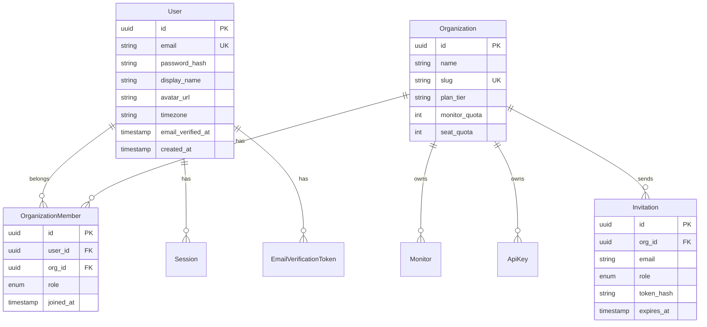
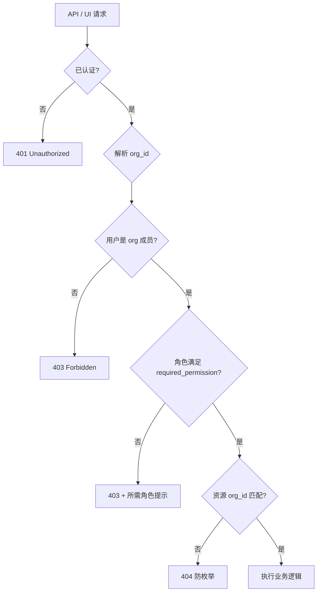
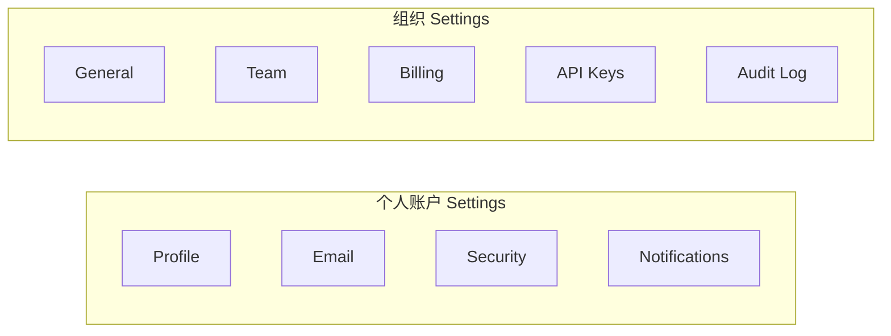
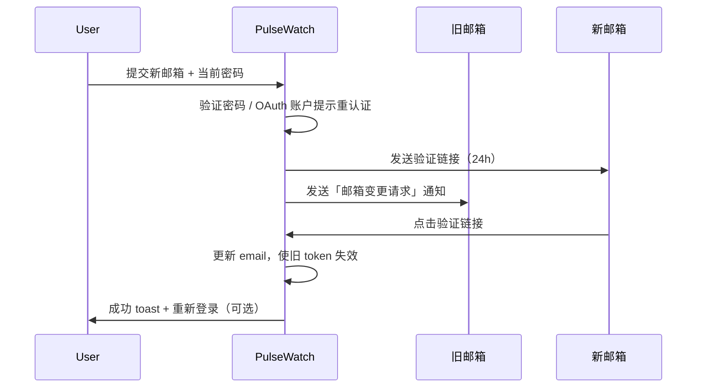
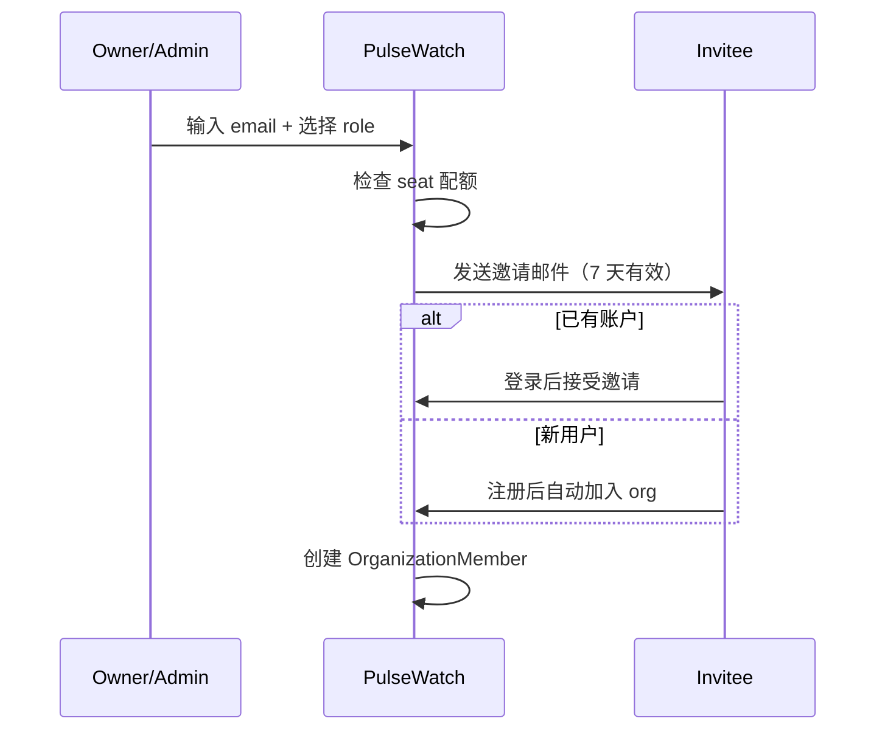
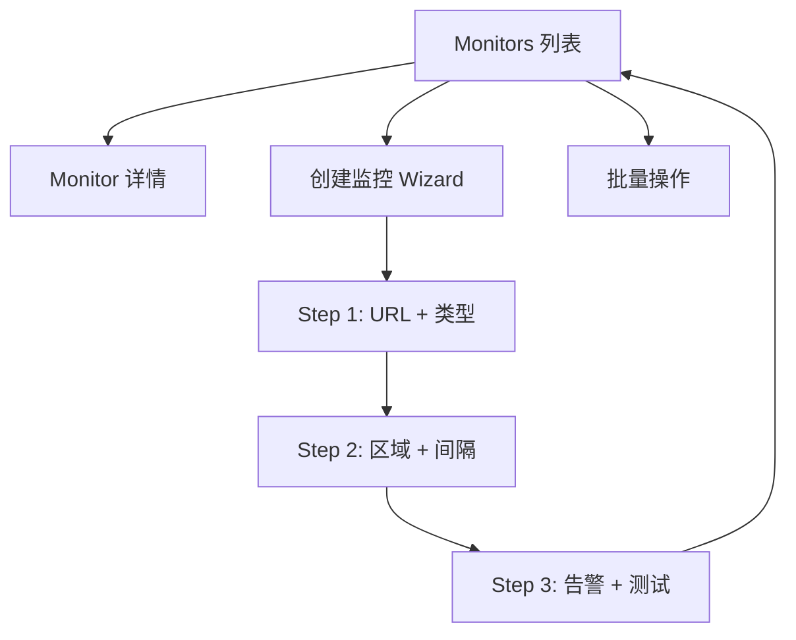
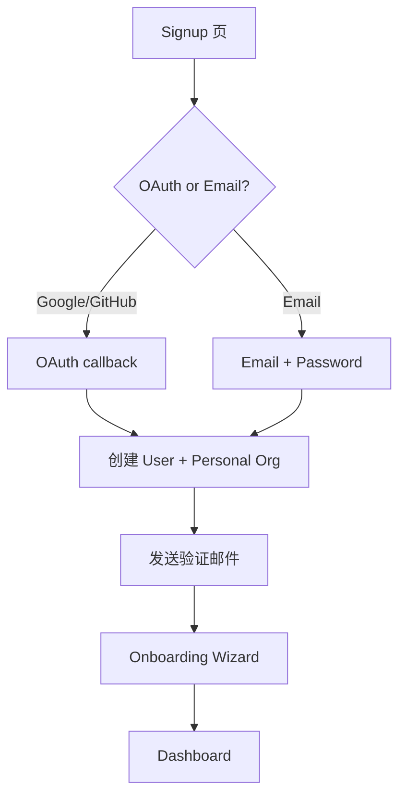
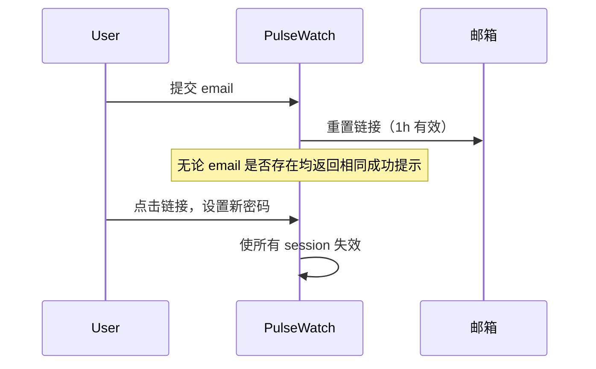

# PulseWatch — 用户与权限管理规格

**文档版本**：v1.0  
**关联文档**：[产品需求文档（PRD）](PRD.md) | [UI/UX 设计规范](UI-UX-DESIGN.md) | [技术设计规格书](TECHNICAL-DESIGN.md)

---

## 1. 概述

PulseWatch 采用 **Organization（组织）** 作为多租户边界。用户通过 **OrganizationMember** 与组织关联，并持有 **角色（Role）** 决定可执行的操作。所有监控、Incident、状态页、API Key 均归属组织，实现 **数据隔离**。

### 1.1 核心概念

| 概念 | 说明 |
|------|------|
| **User** | 全局账户，Email/OAuth 唯一标识 |
| **Organization** | 租户主体，承载订阅、配额、监控资源 |
| **OrganizationMember** | User ↔ Org 关联 + Role |
| **Personal Org** | 注册时自动创建，Free/Pro 单人默认组织 |
| **Team Org** | Team/Business 套餐，支持多成员 |



---

## 2. 角色定义

### 2.1 角色层级

| 角色 | 英文标识 | 说明 | 典型使用者 |
|------|----------|------|------------|
| **Owner** | `owner` | 组织创建者/最高权限；唯一可删除组织、转移所有权 | 创始人、账单负责人 |
| **Admin** | `admin` | 除所有权转移/删除组织外，几乎全权限 | 技术负责人 |
| **Member** | `member` | 日常运维：管理监控、Incident、状态页 | 工程师 |
| **Viewer** | `viewer` | 只读：查看监控、仪表盘、Incident | 产品、客户成功 |

### 2.2 角色约束

- 每个组织 **至少 1 名 Owner**，最多 1 名「活跃 Owner 转移流程中」
- Owner 不能通过 UI 直接降级自己，除非先转移所有权
- 套餐 **seat 限额**：Free/Pro = 1 seat；Team = 5；Business = 20（见 [定价与增长策略](PRICING-AND-GROWTH.md)）
- Viewer 不计入「可编辑席位」但占用 seat 配额（Business 可选「只读不占 seat」Phase 3）

---

## 3. 权限矩阵

### 3.1 功能权限表

| 操作 | Owner | Admin | Member | Viewer |
|------|:-----:|:-----:|:------:|:------:|
| **账户 / 组织** |
| 查看组织信息 | ✅ | ✅ | ✅ | ✅ |
| 修改组织名称/Logo | ✅ | ✅ | ❌ | ❌ |
| 删除组织 | ✅ | ❌ | ❌ | ❌ |
| 转移所有权 | ✅ | ❌ | ❌ | ❌ |
| **成员管理** |
| 邀请成员 | ✅ | ✅ | ❌ | ❌ |
| 移除成员 | ✅ | ✅ | ❌ | ❌ |
| 修改成员角色 | ✅ | ✅ | ❌ | ❌ |
| 撤销待接受邀请 | ✅ | ✅ | ❌ | ❌ |
| **监控（My Websites）** |
| 查看监控列表/详情 | ✅ | ✅ | ✅ | ✅ |
| 创建监控 | ✅ | ✅ | ✅ | ❌ |
| 编辑监控配置 | ✅ | ✅ | ✅ | ❌ |
| 暂停/恢复监控 | ✅ | ✅ | ✅ | ❌ |
| 删除监控 | ✅ | ✅ | ✅ | ❌ |
| 批量操作 | ✅ | ✅ | ✅ | ❌ |
| 导出 CSV/PDF | ✅ | ✅ | ✅ | ✅ |
| **Incident** |
| 查看 Incident | ✅ | ✅ | ✅ | ✅ |
| Acknowledge / 备注 | ✅ | ✅ | ✅ | ❌ |
| 手动创建/关闭 Incident | ✅ | ✅ | ✅ | ❌ |
| **状态页** |
| 查看状态页配置 | ✅ | ✅ | ✅ | ✅ |
| 创建/编辑/发布状态页 | ✅ | ✅ | ✅ | ❌ |
| **告警** |
| 查看告警策略 | ✅ | ✅ | ✅ | ✅ |
| 配置告警渠道/策略 | ✅ | ✅ | ✅ | ❌ |
| 发送测试告警 | ✅ | ✅ | ✅ | ❌ |
| **API Keys** |
| 查看 API Key 列表 | ✅ | ✅ | ❌ | ❌ |
| 创建/撤销 API Key | ✅ | ✅ | ❌ | ❌ |
| **计费** |
| 查看套餐/用量 | ✅ | ✅ | ❌ | ❌ |
| 升级/降级/取消订阅 | ✅ | ❌ | ❌ | ❌ |
| 访问 Stripe Customer Portal | ✅ | ❌ | ❌ | ❌ |
| 查看/下载发票 | ✅ | ✅ | ❌ | ❌ |
| **审计** |
| 查看审计日志 | ✅ | ✅ | ❌ | ❌ |

### 3.2 权限决策流程



### 3.3 权限常量（后端）

```text
Permission 枚举（示例）：
  org:read, org:write, org:delete
  member:invite, member:manage
  monitor:read, monitor:write, monitor:delete
  incident:read, incident:write
  status_page:read, status_page:write
  alert:read, alert:write
  api_key:read, api_key:write
  billing:read, billing:write
  audit:read
```

**角色 → 权限映射** 存于代码或数据库 seed，便于扩展 Custom Role（Business Phase 3）。

---

## 4. 账户设置

### 4.1 设置页面结构



### 4.2 Profile（`/settings/profile`）

| 字段 | 可编辑 | 说明 |
|------|--------|------|
| Avatar | ✅ | 上传 JPG/PNG ≤2MB；或 Gravatar 回退 |
| Display name | ✅ | 2–64 字符 |
| Timezone | ✅ | IANA 时区；影响仪表盘时间显示 |
| Language | 🔜 | Phase 2；MVP 仅 English UI |

**API**：`PATCH /api/v1/me/profile`

### 4.3 Email 变更（`/settings/email`）

**流程**（安全优先，参考 Stripe / GitHub）：



| 规则 | 说明 |
|------|------|
| 新邮箱唯一 | 不可与已有 User 冲突 |
| OAuth 用户 | 无密码时需 OAuth 重新授权 |
| 未验证新邮箱前 | 旧邮箱仍有效 |
| 审计 | 记录 `email.changed` 事件 |

**API**：
- `POST /api/v1/me/email/change-request` — body: `{ new_email, password }`
- `POST /api/v1/me/email/confirm` — body: `{ token }`

### 4.4 密码变更（`/settings/security`）

| 场景 | 流程 |
|------|------|
| Email 注册用户 | 当前密码 + 新密码（≥12 位，zxcvbn 评分 ≥3） |
| OAuth-only 用户 | 显示「Set password」启用密码登录 |
| 修改成功 | 可选「登出其他所有会话」 |

**API**：`POST /api/v1/me/password/change`

### 4.5 双因素认证（2FA）— Phase 2

| 项目 | 说明 |
|------|------|
| 类型 | TOTP（Google Authenticator / 1Password） |
| 套餐 | Pro 可选；Team+ 可组织级强制 |
| 恢复码 | 10 个一次性码 |
| UI | Security 页「Enable 2FA」wizard |

MVP 显示 **Coming soon** 徽章，不阻塞发布。

### 4.6 通知偏好（`/settings/notifications`）

| 选项 | 默认 | 说明 |
|------|------|------|
| Incident 即时邮件 | ON | 用户作为 org 成员收到的告警 |
| 周报摘要 | ON | 过去 7 天 uptime 摘要 |
| 产品更新 | OFF | 营销邮件，可 unsub |
| SSL 到期提醒 | ON | 仅当用户创建了 SSL 监控 |

**API**：`PATCH /api/v1/me/notifications`

### 4.7 API Keys（`/settings/api-keys`）

| 字段 | 说明 |
|------|------|
| Name | 用户自定义，如「CI Pipeline」 |
| Scope | `read` / `write` / `admin` |
| Prefix | 显示 `pw_live_abc...`，完整 key 仅创建时展示一次 |
| Expires | 可选 90d / 1y / 永不过期 |
| Last used | 时间 + IP |

**Scope 权限**：

| Scope | 允许操作 |
|-------|----------|
| `read` | GET 监控、Incident、CheckResult |
| `write` | + POST/PATCH/DELETE 监控、Incident ack |
| `admin` | + 成员管理、API Key 管理（不含 billing） |

**API**：
- `GET /api/v1/orgs/{orgId}/api-keys`
- `POST /api/v1/orgs/{orgId}/api-keys`
- `DELETE /api/v1/orgs/{orgId}/api-keys/{keyId}`

---

## 5. 组织与团队管理

### 5.1 邀请流程



| 规则 | 说明 |
|------|------|
| 邀请上限 | 每 org 待处理 ≤20 |
| 同邮箱重复邀请 | 撤销旧邀请，发新链接 |
| 接受后角色 | 以邀请时为准；Owner 不可通过邀请授予 |
| 移除成员 | Admin 不可移除 Owner |

### 5.2 Team 管理 UI（`/settings/team`）

| 元素 | 规范 |
|------|------|
| 成员表格 | Avatar、Name、Email、Role（dropdown 可编辑）、Joined、Actions |
| 待接受邀请 | 子表格：Email、Role、Sent、Revoke |
| 邀请模态 | Email 输入 + Role 选择 + 「Send invite」 |
| Seat 用量 | Progress bar「3 / 5 seats used」 |
| 权限不足 | Member/Viewer 看到只读列表，无邀请按钮 |

### 5.3 组织切换

- 用户可属于多个 org（Agency 场景）
- **Org Switcher**：Sidebar 顶部 dropdown（参考 Vercel Team Switcher）
- 切换后：所有 API 请求带 `X-Org-Id` header 或 path prefix `/orgs/{slug}/...`
- 最近访问 org 存 localStorage

---

## 6. 我的网站（Monitor 管理 UX）

### 6.1 信息架构

「Monitors」= 用户视角的 **My Websites**，与 PRD C.2 监控类型对应。



### 6.2 列表视图规范

| 功能 | 说明 |
|------|------|
| **默认排序** | DOWN 优先 → 最近 Incident → 名称 A-Z |
| **筛选器** | Status、Type（HTTP/TCP/SSL…）、Tag、Region |
| **搜索** | 模糊匹配 name、target_url |
| **列自定义** | Phase 2；MVP 固定列 |
| **批量操作** | Pause、Resume、Delete、Assign tag |
| **快速状态** | 行首 ● 色点 + 24h uptime %；hover 显示 last check 时间 |
| **配额提示** | 接近上限时顶部 banner「14/15 monitors — Upgrade for 50」 |

### 6.3 创建监控 Wizard

| 步骤 | 字段 | 验证 |
|------|------|------|
| 1. What to monitor | URL、Type、Friendly name | URL 格式；重复检测提示 |
| 2. How often | Interval、Regions | 套餐限制 interval/region |
| 3. Alerts | Email 默认 ON；Webhook 可选 | 「Send test alert」按钮 |
| 完成 | 跳转详情页 + confetti 微动画 | 首次检查 pending 状态 |

**模板快捷创建**（P1）：WordPress、Stripe Webhook、REST API Health — 预填 URL 模式与 keyword。

### 6.4 详情页权限表现

| 角色 | 表现 |
|------|------|
| Viewer | 所有表单只读；无 Delete / Pause 按钮 |
| Member+ | 完整编辑；Settings tab 可修改 |
| 无跨 org 访问 | URL 猜 id 仍 404 |

---

## 7. 认证流程

### 7.1 注册



| 规则 | 说明 |
|------|------|
| 密码强度 | ≥12 字符；Have I Been Pwned 可选校验 |
| OAuth | Google + GitHub；scope: email, profile |
| 账户合并 | 同 email OAuth 登录 → 合并到已有 User |
| Personal Org | 自动命名 `{display_name}'s Workspace` |

### 7.2 登录

- Email + Password
- OAuth 一键登录
- **Magic Link**（P1）：15 分钟有效
- 失败 5 次 → 15 分钟 lockout（IP + email）
- 「Remember me」→ 30 天 refresh token

### 7.3 忘记密码



### 7.4 邮箱验证

- 注册后未验证：可登录，但不可创建 >3 个监控
- Banner 提示「Verify your email to unlock full features」
- 重发冷却 60s

### 7.5 Session 管理

| 项目 | 说明 |
|------|------|
| Access Token | JWT 15min |
| Refresh Token | HttpOnly cookie 30d |
| Session 列表 | Security 页展示设备/IP/最后活跃 |
| 撤销 | 单个或「登出所有其他设备」 |

---

## 8. 数据隔离

### 8.1 隔离策略

| 层级 | 机制 |
|------|------|
| **应用层** | 所有查询强制 `WHERE org_id = :current_org_id` |
| **PostgreSQL RLS** | `organization_members` 验证 + 行级策略 |
| **ClickHouse** | 查询必带 `org_id`；API 层校验 |
| **Redis** | Key prefix `org:{id}:` |
| **API Key** | 绑定单一 org_id + scope |
| **Status Page** | 公开页仅暴露该 org 下已发布组件 |

### 8.2 跨租户访问防护

- 资源 ID 使用 UUID v4，不可枚举
- 访问其他 org 资源返回 **404**（非 403，防信息泄露）
- 审计日志记录跨 org 访问尝试

### 8.3 Agency 多客户模型（Business Phase 3）

- **Monitor Groups / Tags** 按客户分组
- 可选 **Restricted Member**：仅见特定 tag 下监控
- 白标状态页按客户 slug 划分

---

## 9. API 端点概要

### 9.1 认证

| Method | Path | 说明 |
|--------|------|------|
| POST | `/api/v1/auth/register` | Email 注册 |
| POST | `/api/v1/auth/login` | 登录 |
| POST | `/api/v1/auth/logout` | 登出 |
| POST | `/api/v1/auth/refresh` | 刷新 token |
| GET | `/api/v1/auth/oauth/{provider}` | OAuth 发起 |
| GET | `/api/v1/auth/oauth/{provider}/callback` | OAuth 回调 |
| POST | `/api/v1/auth/forgot-password` | 忘记密码 |
| POST | `/api/v1/auth/reset-password` | 重置密码 |
| POST | `/api/v1/auth/verify-email` | 邮箱验证 |

### 9.2 当前用户

| Method | Path | 说明 |
|--------|------|------|
| GET | `/api/v1/me` | 当前用户 + 所属 org 列表 |
| PATCH | `/api/v1/me/profile` | 更新资料 |
| POST | `/api/v1/me/email/change-request` | 请求改邮箱 |
| POST | `/api/v1/me/email/confirm` | 确认新邮箱 |
| POST | `/api/v1/me/password/change` | 改密码 |
| PATCH | `/api/v1/me/notifications` | 通知偏好 |
| GET | `/api/v1/me/sessions` | Session 列表 |
| DELETE | `/api/v1/me/sessions/{id}` | 撤销 session |

### 9.3 组织

| Method | Path | 权限 | 说明 |
|--------|------|------|------|
| GET | `/api/v1/orgs/{orgId}` | member+ | 组织详情 |
| PATCH | `/api/v1/orgs/{orgId}` | admin+ | 更新名称/Logo |
| DELETE | `/api/v1/orgs/{orgId}` | owner | 删除组织 |
| POST | `/api/v1/orgs/{orgId}/transfer-ownership` | owner | 转移所有权 |

### 9.4 成员

| Method | Path | 权限 | 说明 |
|--------|------|------|------|
| GET | `/api/v1/orgs/{orgId}/members` | member+ | 成员列表 |
| POST | `/api/v1/orgs/{orgId}/invitations` | admin+ | 发送邀请 |
| GET | `/api/v1/orgs/{orgId}/invitations` | admin+ | 待接受邀请 |
| DELETE | `/api/v1/orgs/{orgId}/invitations/{id}` | admin+ | 撤销邀请 |
| POST | `/api/v1/invitations/{token}/accept` | authenticated | 接受邀请 |
| PATCH | `/api/v1/orgs/{orgId}/members/{userId}` | admin+ | 改角色 |
| DELETE | `/api/v1/orgs/{orgId}/members/{userId}` | admin+ | 移除成员 |

### 9.5 监控

| Method | Path | 权限 | 说明 |
|--------|------|------|------|
| GET | `/api/v1/orgs/{orgId}/monitors` | member+ | 列表（分页、筛选） |
| POST | `/api/v1/orgs/{orgId}/monitors` | member+ | 创建 |
| GET | `/api/v1/orgs/{orgId}/monitors/{id}` | member+ | 详情 |
| PATCH | `/api/v1/orgs/{orgId}/monitors/{id}` | member+ | 更新 |
| DELETE | `/api/v1/orgs/{orgId}/monitors/{id}` | member+ | 删除 |
| POST | `/api/v1/orgs/{orgId}/monitors/bulk` | member+ | 批量 pause/resume/delete |
| POST | `/api/v1/orgs/{orgId}/monitors/{id}/test-alert` | member+ | 测试告警 |

### 9.6 错误码

| HTTP | Code | 说明 |
|------|------|------|
| 401 | `UNAUTHORIZED` | 未登录或 token 过期 |
| 403 | `FORBIDDEN` | 角色不足 |
| 403 | `SEAT_LIMIT_REACHED` | 席位已满 |
| 403 | `MONITOR_QUOTA_EXCEEDED` | 监控数超限 |
| 404 | `NOT_FOUND` | 资源不存在或无权 |
| 409 | `EMAIL_ALREADY_EXISTS` | 邮箱冲突 |
| 429 | `RATE_LIMITED` | 登录/邀请频率限制 |

---

## 10. 用户故事

| ID | 故事 | 验收 |
|----|------|------|
| UM-01 | 作为 Owner，我邀请同事为 Admin，以便共同管理监控 | 邀请邮件 7d 内可接受；角色生效 |
| UM-02 | 作为 Member，我批量暂停维护中的监控，以便避免误报 | 批量 pause ≤50 个/次 |
| UM-03 | 作为 Viewer，我只能查看仪表盘，不能修改任何配置 | 所有 write API 返回 403 |
| UM-04 | 作为用户，我修改密码并登出其他设备，以便账户被盗后自救 | Session 列表 + 一键 revoke |
| UM-05 | 作为 Agency Owner，我切换 org 查看不同客户监控 | Org switcher 正确隔离数据 |

---

## 相关文档

- [产品需求文档（PRD）](PRD.md)
- [UI/UX 设计规范](UI-UX-DESIGN.md)
- [技术设计规格书](TECHNICAL-DESIGN.md)
- [路线图与指标](ROADMAP.md)
